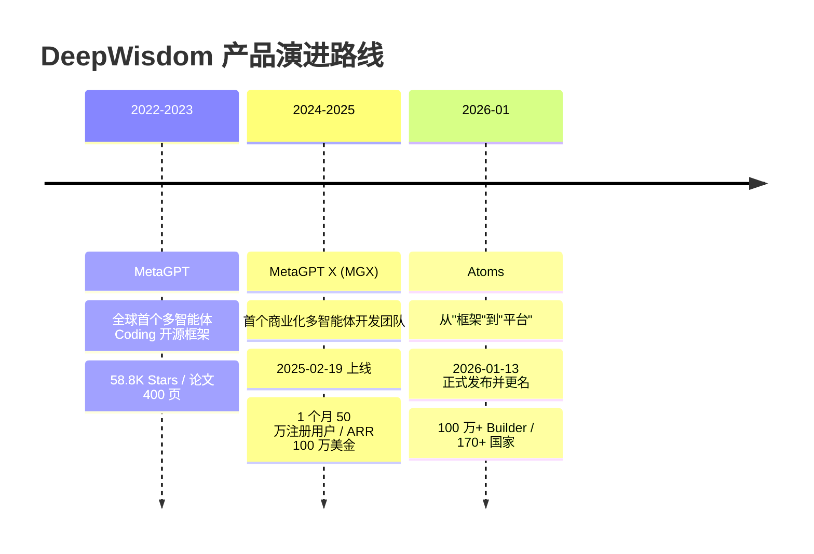
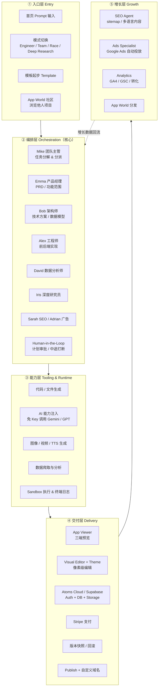
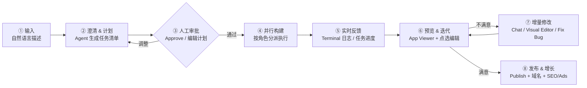

# Atoms 平台调研报告

> **调研对象**：Atoms（https://atoms.dev）
> **调研时间**：2026 年 9 月 17 日
> **调研目的**：为 ROOT 组 AI Native 研发岗笔试 Demo 做产品侧认知储备
> **信息来源**：Atoms 官网与营销页、help.atoms.dev 帮助中心（Quick Start / App Viewer / Agents Team / Mode Switching / Glossary）、官方 Changelog（2025-03 ~ 2026-07）、官方博客、36氪《智能涌现》、暗涌Waves 创始人访谈、腾讯新闻、第三方评测（Unite.AI / MarkTechPost / AIPURE / EasyAI / appscribed）与公开数据平台
>
> **数据口径说明**：官网自述数据（用户量、GitHub Star、效果对比）未经独立审计；第三方流量为 SimilarWeb 类估算，误差较大。本报告已在关键数据处标注来源与时间，请在使用时保留口径意识。

---

## 0. 摘要：一页纸读懂 Atoms

| # | 结论 | 依据 |
|---|---|---|
| 1 | **Atoms 不是"AI 代码编辑器"，而是"AI 创业团队"**。它卖的不是代码生成能力，而是「从想法到可收款产品」的完整商业闭环。 | 官方定位 "Vibe Business"；创始人访谈原话："Lovable 和 Replit 更多是帮你写代码的工具，而 Atoms 是帮你启动公司的平台" |
| 2 | **产品护城河建立在"多智能体 + 开源底座 + 极致性价比"三角上**。MetaGPT 提供 15 万+ Star 的技术口碑，DeepSeek/Qwen 组合把成本压到竞品的 ~20%。 | 自述：成本比竞品低 80%、效果超出 45%；成本约为 GPT-4 的 10% |
| 3 | **真正的差异点是"交付深度"**：内置用户登录、PostgreSQL、Stripe 支付、托管部署、SEO/Ads Agent。竞品大多止步于前端原型。 | 官网功能矩阵、2026-05 数据库管理界面上线 |
| 4 | **交互设计的核心是"把黑盒过程变白盒"**：Terminal/Console 面板、计划审批（Approve）、任务流水、一键 Resolve 修复。 | App Viewer 文档、Changelog 2025-11 "Human-in-the-Loop 审查步骤" |
| 5 | **"编辑"被拆成三种粒度**：Theme（全局设计系统）→ Visual Editor（点选像素级改）→ Chat（逻辑级重构）。这是一个非常克制的分层。 | 官方博客《Introducing Theme and Visual Editor》 |
| 6 | **增长链路被前置到生成链路里**：SEO Agent（Sarah）、Ads Specialist（Adrian）也在团队编制内。这是竞品普遍缺失的一层。 | 官网 Agent 团队、Changelog 2026-03-31 Ads Agent |
| 7 | **风险集中在"信任与成本"**：credits 消耗不透明、Race Mode 锁在 Max 档、早期有计费投诉。 | Trustpilot 早期反馈、EasyAI 评测、定价页 |
| 8 | **对本笔试的直接启示**：Atoms 的能力骨架（编排 + 沙箱预览 + 持久化 + 发布）在 6–8h 内可以做出**可信的微缩版**；但简单的复刻拿不到创新分，必须找到一个"Atoms 没做好的点"作为切入点。 | 见第 9 章 |

---

## 1. 公司与产品沿革

### 1.1 背后的公司：DeepWisdom（厦门深度赋智）

理解 Atoms 必须先理解它的组织，因为**这个产品本身就是它组织形态的产物**。

| 维度 | 事实 |
|---|---|
| 公司 | 厦门深度赋智科技有限公司（DeepWisdom），成立于 2017-07-26，品牌创立于 2019 |
| 创始人 / CEO | 吴承霖（Chenglin Wu / Alex Wu），厦门大学计算机系，曾任华为、腾讯；福布斯中国 30 Under 30（2018）、胡润 30 Under 30 |
| 团队规模 | 约 80 人，分布厦门 / 深圳 / 上海，计划扩至 120 人 |
| 核心成员背景 | Google、Anthropic、字节、腾讯、华为、CMU、UC Berkeley、清华 |
| 融资 | 2025 年两轮共 **2.2 亿人民币（约 3100 万美元）**：3 月蚂蚁集团 1 亿人民币；6 月凯辉基金领投、锦秋资本跟投 1700 万美元。投资方另有 BV 百度风投、概念资本。**超募 4 倍**，主动少拿 |
| 开源组织 | **Foundation Agents**，GitHub Stars 超 15 万（官网 2026 年展示为 168K+），自称全球最大多智能体开源组织 |
| 学术资产 | 约 30 篇论文。**MetaGPT（ICLR 2024 Oral）、AFlow（ICLR 2025 Oral）、Atom of Thoughts（NeurIPS 2025）、AutoWebWorld（ICML 2026）、AOrchestra（arXiv 2026）**；NeurIPS 投稿 9 篇中 5 篇，3 篇 Oral |
| 荣誉 | Product Hunt #1 Product of the Day & Week；Open100 开源影响力认可；2026 Technology Pioneer |

**关键组织特征 —— ROOT 组**（这解释了本次笔试的由来）：

> 内部不到 15 名最核心的「通才」组成 ROOT 组。没有产品经理、算法工程师的职权划分，需要负责从前端、后端到算法、测试的全栈开发，目的是**避免传统分工中冗长的需求传递**。招聘方式大量来自用户社区与 Mini Hackathon —— 因为"用户在产品实操中的表现，比简历更能体现通才能力"。

这与笔试邀请函里的表述完全同构：

- "工程师不仅仅是写代码的人，由团队端到端发现问题、解决问题、完成需求、发起评审，避免冗长的需求传递"
- "更关注你如何借助 AI 工具，将想法快速转化为一个可运行、可体验、可扩展的产品原型"

**组织理念**：吴承霖称 DeepWisdom 在打造"学术循环型组织"——内部文档与计划近乎完全透明，每个任务必须产出原子化成果，绩效由协作者打分决定。开源、论文、闭源商业化形成一个闭环。

### 1.2 三代产品演进



| 阶段 | 代表 | 核心问题 | 关键数据 | 战略意义 |
|---|---|---|---|---|
| **研究验证** 2022–2023 | MetaGPT | "多智能体能否像人类团队一样协作写代码？" | GitHub 58.8K Stars；论文定义基础智能体技术路线 | 用论文 + 开源**验证技术假设**并建立人才与技术口碑 |
| **产品化** 2024–2025 | MGX | "能否把多智能体卖给普通人？" | 上线 1 个月：50 万注册、ARR 100 万美金；0 投放；Product Hunt 双榜第一；2025-09 月访问 120 万、日均生成应用 1 万+ | **验证付费意愿**，但被诟病生成物是"玩具" |
| **平台化** 2026– | Atoms | "能否交付一个能赚钱的生意，而不是一个页面？" | 更名；100 万+ Builder；170+ 国家 | 补齐商业基础设施（后端/支付/域名/增长），从 **Vibe Coding** 升维到 **Vibe Business** |

### 1.3 为什么从 MGX 改名为 Atoms

官方给出的两个理由（见 36氪访谈）：

1. **传播成本**：在英语语境下 "MGX" 发音不友好，不利于 C 端口碑传播。
2. **品牌隐喻**：Atoms（原子）= "Scaling 前的最小单位"。公司的核心叙事是「**原子创业**」——未来商业世界不是被大公司垄断，而是由无数个"原子化小公司"组成的生态网络。每个碎片化的想法都是一个原子，通过 Atoms 拓展团队、公司、创业的边界。

> 我认为改名还隐含了第三层意图：**摆脱"MetaGPT 技术 Demo"的标签，向"平台型产品"迁移**。名字从技术缩写（MetaGPT X）变成隐喻性名词（Atoms），是典型的从"技术品牌"到"用户品牌"的切换动作。

### 1.4 战略意图（从创始人访谈中提炼）

三句话概括吴承霖的终局判断，它们直接决定了 Atoms 的产品取舍：

1. **"上一代 CEO 是资源驱动，这一代是技术驱动。我们不是在加速信息的传递，而是在供给'智力'本身。"**
   → 产品不能只是"帮人写草稿、出 Demo"，而要**替代商业环节本身**。

2. **"未来的生产力扩张不再依赖招人，而是依赖硅的扩张（Silicon Scaling）。"**
   → 所以 Atoms 的终局形态是"可无限扩容的 AI 团队"，Team Mode / 多 Agent 是必经之路，不是营销话术。

3. **"我不想做工具，我想构建的是整个'智能体互联网'的基础设施。"**
   → 长期看，Atoms 要做的是 Agent 之间的协作协议与调度基础设施，而当前的产品形态只是它的第一个商业化出口。

**一个重要反共识观点**：吴承霖公开反对"一人公司"神话——"当每个人拥有计算机时，就相当于无人拥有计算机"，AI 赋能意味着"卷度只会上升"。所以 DeepWisdom 自己并未把团队压缩到 10 人以内，而是保持 80+ 人并在扩张。这说明**Atoms 自己的产品哲学（一个人顶一个团队）和它自己的组织选择（规模化团队）之间存在张力**，这一点在评估产品叙事时值得注意。

---

## 2. 产品定位与价值主张

### 2.1 一句话定位

> **Atoms 是一个由多智能体团队驱动的下一代 AI Agent 平台，把一句自然语言想法转化为一个可部署、可收款、可增长的完整 Web 应用。**

三个关键词拆开：

| 关键词 | 含义 | 反面（竞品常见状态） |
|---|---|---|
| **多智能体团队** | 不是单个 coding agent，而是 7–8 个角色分工协作，有 SOP、有交接、有审批 | 单个 LLM 在一个对话里串行写完 |
| **可部署可收款** | 内置 Auth + PostgreSQL + Stripe + 托管 + 域名 | 只给你一个前端原型 / 预览链接 |
| **可增长** | SEO Agent、Ads Agent、数据分析 Agent 编入团队 | 生成完就结束，分发靠用户自己 |

### 2.2 目标用户画像

从创始人访谈与官方成功案例可归纳为四类（**注意：用户画像极为分散**，这既是优势也是定位风险）：

| 类型 | 特征 | 典型诉求 | 案例 |
|---|---|---|---|
| **非技术创业者 / 超级个体** | 有想法、无技术、决策链短 | 用最小成本验证并变现一个 idea | 马来西亚珠宝商人做电商站接 Stripe 收款 |
| **垂直小微业主** | 已有生意，需要内部工具 | 把散落在多个 App 的流程合并成一个 | 美国窗户清洁公司（预约估价 + 排期 + 客户文档） |
| **自由职业者 / 外包开发者** | 懂一点技术，追求交付效率 | 快速产出可交付物，省去 boilerplate | 用 Atoms 交付客户站点 |
| **产品型开发者** | 会写代码，想跳过重复劳动 | 跳过 Auth/CRUD/Dashboard，专注独有逻辑 | 从 GitHub 导出代码继续改 |

官方强调的一个动人案例：**一位 80 多岁的加拿大爷爷**，零技术背景，用 Atoms 为孙女做了一套个性化教育产品。**一位加拿大修车工人**，下班后用手机做出了一款 2D 机器人对战游戏，并在 Discord 建了 15–20 人的测试社区持续迭代。

> **产品洞察**：这两个案例说明 Atoms 真正的破圈点不是"省钱"，而是**"把过去不可能的人的创意释放出来"**。这是它和其他 coding 工具在叙事层面最大的差别——竞品讲效率，Atoms 讲**人的可能性**。

### 2.3 官方价值主张 → 翻译成人话

主页五条主张，我做了"去营销化"翻译：

| 官网原文 | 人话翻译 | 可信度评估 |
|---|---|---|
| Go live in minutes, not weeks | **速度**：对话即生成，分钟级出可用页面 | 部分可信。简单页面确实分钟级；带后端+支付的完整应用，实测需 20 分钟到数小时多次迭代 |
| Real apps, not just demos | **真后端**：登录、数据库、Stripe 是真的，不是 mock | 可信，这是核心差异化。Supabase/Atoms Cloud 是真实基础设施 |
| Business toolkits, all in one place | **一体化**：调研→开发→部署→SEO→投放→数据，全在一个工作台 | 可信但成熟度不均。SEO/Ads Agent 较新，且 SEO Agent 曾在定价页标注 "Coming Soon" |
| Gain paying customers and revenue | **能赚钱**：直接接 Stripe 收款 | 可信，但"能收款"≠"有人付钱"，营销链路才是瓶颈 |
| Stay fully in control | **可带走**：随时导出代码、同步 GitHub | 可信。这一条是打消开发者顾虑的关键设计（防止供应商锁定恐慌） |

### 2.4 与"AI 代码助手"的本质差异

这是理解 Atoms 最重要的一条分界线：

```
AI 代码助手 (Cursor / Copilot / Claude Code)      Atoms
├─ 交付物：代码变更 diff                          ├─ 交付物：一个已部署、可访问、可收款的线上应用
├─ 用户：开发者                                  ├─ 用户：任何有想法的人
├─ 界面：IDE                                     ├─ 界面：对话 + 可视化预览工作台
├─ 价值度量：写代码的速度                        ├─ 价值度量：从想法到第一笔收入的时间
└─ 商业闭环：用户自己负责                        └─ 商业闭环：平台内置

                    ↓  升维的关键动作  ↓
    把「后端 + 支付 + 部署 + 分发」这四件"非代码"的事，也变成 Agent 的工作
```

> **一句话**：Cursor 让程序员更快，Atoms 让"不需要程序员"这件事成立。

---

## 3. 产品架构：五层解构

我用"平台分层"的方式重建 Atoms 的能力结构。这张图是后续 Demo 设计的直接参考：



**分层解读**：

- **入口层**很轻，本质只有"输入 + 模式选择"。这一层是转化率工程，不是技术难点。
- **编排层是真正的护城河**。竞品可以调用同样的模型，但很难复刻"角色分工 + SOP + 审批节点"这套协作协议——它来自 MetaGPT 三年的论文积累。
- **能力层**的核心设计是**"把外部能力变成平台的原子能力"**：图像、视频、TTS、爬虫、AI 模型调用都收进来，用户不需要管 API Key。
- **交付层**是差异化最大的一层。`Atoms Cloud` 让"对话生成"直接变成"生产环境"。
- **增长层**是 Atoms 独有的第四跳。**大多数同类产品在"交付"就结束了，Atoms 把"分发"也纳入了产品闭环**——这是从 Vibe Coding 走向 Vibe Business 的关键落子。

---

## 4. 核心机制拆解

### 4.1 Agent 团队编制表

| Agent | 角色 | 职责（官方原文） | 实际产出物 | 备注 |
|---|---|---|---|---|
| **Mike** | Team Leader | 协调任务分派与整体执行 | 执行计划、审批请求、进度汇报 | 可闲聊、可实时联网取信息 |
| **Emma** | Product Manager | 把想法翻译成可执行计划 | **PRD**、功能优先级、用户旅程 | 防范围蔓延（scope creep） |
| **Bob** | System Architect | 设计技术蓝图 | 架构文档、数据模型、API 结构 | 微服务 / 云基础设施 / API 集成方案 |
| **Alex** | Software Engineer | 全栈实现与部署 | 可运行的前后端代码 | Engineer Mode 下唯一激活的 Agent |
| **David** | Data Analyst | 处理数据集、做可视化 | 图表、洞察报告 | 兼 AI/ML 能力（爬虫、NLP、预测） |
| **Iris** | Deep Researcher | 抓取网络信息、整理分析报告 | 深度调研报告（来源可追溯） | 官方声称研究能力超过 Gemini-2.5-Pro / Perplexity |
| **Sarah** | SEO Specialist | 多语言 SEO 内容与优化 | 页面内容、sitemap、元信息 | 2026-01 上线 |
| **Adrian** | Ads Specialist | Google Ads 投放全流程 | 广告创意、关键词、出价策略、全漏斗分析 | 2026-03-31 上线 |

**设计观察**：这套编制几乎完整映射了一家真实创业公司的最小团队。**角色命名拟人化（Iris/Bob/Emma/Mike/Alex/Sarah/David）是一个被低估的产品决策**——它让用户从"我在操作一个工具"切换到"我在管理一个团队"，心理模型完全不同，也天然为"审批 / 汇报 / 分派"这些交互提供了合法性。

### 4.2 四种模式：速度、成本、能力的三角权衡

| 模式 | 激活 Agent | 适用场景 | 成本 | 门槛 |
|---|---|---|---|---|
| **Engineer Mode** | 仅 @Alex | 简单网站、快速原型、Demo | 低 | 全部用户 |
| **Team Mode** | 多 Agent 团队 | 复杂需求、市场调研、数据分析 | 高 | 全部用户 |
| **Deep Research Mode** | @Iris | 商业/学术/市场分析报告 | 中 | 全部用户 |
| **Race Mode** | 多模型并行跑同一 Prompt | 需要多方案对比择优 | 最高 | **仅 Max 档** |

**点评**：模式切换是 Atoms 里**最优雅的成本控制机制**。它不是限制用户用量，而是**让用户在"我知道我在干什么"的前提下主动选择花多少**。这是一个典型的"把复杂度控制权交还用户"的产品设计。

Race Mode 锁在 Max（$79/月）是一个有争议的决策：它既是最高感知价值的卖点，又被付费墙挡住导致大多数用户无法体验。评测中已有用户抱怨"我在 Prompt 里要求四种方案，结果只生成了一种"。**这是一个明显的机会缺口。**

### 4.3 端到端工作流（8 阶段）



**每个环节的产品意图**：

| 阶段 | 关键设计 | 解决的问题 |
|---|---|---|
| ② 澄清 & 计划 | 生成可编辑的任务清单 | 避免"进黑洞"——用户不知道该等多久、AI 在干什么 |
| ③ 人工审批 | Approve 按钮 | **成本前置**：在写第一行代码前对齐方向，避免昂贵的返工 |
| ④ 并行构建 | 按角色分派 | 提高吞吐；也让用户看到"团队在工作" |
| ⑤ 实时反馈 | Terminal + Console 面板 | 用"工程感"换取信任——**这是 Atoms 一个非常聪明的心理设计：让非技术用户也能看到"编译日志"，从而相信这不是在瞎编** |
| ⑥ 预览 & 迭代 | App Viewer | 把抽象代码变成可感知的实物，降低非技术用户的验证门槛 |
| ⑦ 增量修改 | 三种编辑粒度 + 一键 Resolve | 把"改一个小地方"的成本从"重新生成整个应用"降到"改一个属性" |
| ⑧ 发布 & 增长 | Publish + SEO/Ads | 闭合商业链路 |

### 4.4 Human-in-the-Loop 的具体设计

Atoms 的 HITL 不是"每步都问你"，而是**在成本拐点上问**：

| 触发点 | 形式 | 用户动作 | 设计意图 |
|---|---|---|---|
| 计划生成后 | 任务清单卡片 | Approve / 编辑 / 删除任务 | 方向对齐，防返工 |
| 需要外部凭据 | 参数请求卡片（如 Stripe Key） | 填写 / Skip（用 mock） | 允许"先看效果再配置" |
| 构建出错 | Issue Report + Resolve 按钮 | 一键让 Agent 修 | 降低报错恐慌 |
| 关键决策 | Ask Human 倒计时 | 选择 / 等待超时 | 防止流程无限挂起 |
| 交付前 | Preview 供检视 | 目视检查 + 点选修改 | 最终把关 |

> **可复用的原则**：HITL 应该放在**"纠正成本即将变高"**的位置，而不是"AI 每做一步就确认"的位置。前者是效率，后者是骚扰。

### 4.5 增量迭代与版本管理

- **版本快照**：每次构建产生版本，支持预览切换与**回滚保护**（2026-01）
- **长对话连续性**：2026-07 专门优化，说明上下文窗口是真实瓶颈
- **构建任务恢复**：2026-06 上线，中断后可续
- **Chat 消息队列**：2026-06 上线，支持暂停/恢复/重排/编辑/删除/清空——用户可以在 Agent 工作时排队多个修改指令
- **Prompt Queue**：2026-06 "立即发送"

> **这几条 Changelog 暴露了这类产品最难的部分**：不是"生成"，而是**"生成后的可维护性"**——长会话上下文管理、断点续建、消息队列、版本管理。这恰恰是 6–8h Demo 最容易忽略、也最能体现工程思维的地方。

### 4.6 后端与基础设施

| 能力 | 实现 | 用户感知 |
|---|---|---|
| 数据库 | Atoms Cloud（PostgreSQL 系）或接入 Supabase | "一键生成数据库" |
| 认证 | 内置（Email / OAuth / Magic Link） | "不用配登录" |
| 支付 | Stripe 一键接入（Checkout / Payment Intents / Webhook） | "授权一下就能收款" |
| 文件存储 | App Storage（每用户最多 10 个 bucket） | 拖拽上传即用 |
| 密钥管理 | Secrets / URL 引用（2026-05） | 不用在前端硬编码 Key |
| 部署 | 一键 Publish，自动 HTTPS、CDN、稳定子域 | "点一下就上线" |
| 自定义域名 | Pro 以上；DNS/SSL 检查、主域名管理、子域支持 | 品牌感 |
| 数据库管理界面 | 2026-05-18 上线 | 用户可直接看/改数据表 |
| 移动端 | 2026-05-06 支持移动应用生成、二维码预览、Android 构建 | 从 Web 扩展到 App |

**战略含义**：`Atoms Cloud` 是这家公司从"工具"走向"平台"的关键基础设施。**只要用户的应用跑在 Atoms Cloud 上，用户就跑不掉**——这才是订阅费之外真正的商业护城河（创始人访谈也提到了未来的"基础设施费"和"业务分成"）。

### 4.7 增长闭环

```
    ┌──────────────────────────────────────────────┐
    │                                              │
    ▼                                              │
 生成应用 ─→ 发布上线 ─→ SEO 内容矩阵 ─→ 自然流量 ──┤
    │                       (Sarah)              │
    │                          │                 │
    │                          ▼                 │
    ├────────→ Google Ads 投放 (Adrian) ──→ 付费流量
    │                          │                 │
    │                          ▼                 │
    │                    Stripe 收款             │
    │                          │                 │
    │                          ▼                 │
    └────────────── Analytics 分析 ───────────────┘
                    (David)
```

**这是 Atoms 与所有竞品最大的结构性差异**：别人的产品生命周期在"生成完成"结束，Atoms 的生命周期在"生成完成"才开始。官方叙事的落点是「**从 Vibe Coding 升级为 Vibe Business**」。

---

## 5. 交互设计分析

> 这一章是本报告的重点——笔试的核心评估维度是"用户体验"与"创新性"，而这两个维度只能通过对交互模式的理解来提升。

### 5.1 首页：一个极其克制的入口

元素构成：

1. **一句主标题**（Turn ideas into products that sell）
2. **一个大输入框**（占视觉中心）
3. **输入框内嵌的模式切换按钮**（左下角）—— 关键设计：**模式选择不是一个独立页面，而是输入体验的一部分**
4. **示例分类芯片**（AI Tool / Internal Tool / SaaS / Dashboard / E-commerce / Game / Landing Page / Personal Apps）
5. **模板卡片**（Investment Portfolio Monitor / AI-Powered Manga App / Fitness App）
6. **社会证明条**（GitHub Stars / Product Hunt #1 / ~30 篇论文 / 品牌 Logo 墙）

**可借鉴的 3 点**：

- ✅ **单一 CTA**：首页只有"描述你想做什么"这一个动作，没有注册墙前置，没有功能菜单干扰。
- ✅ **降低启动焦虑**：示例芯片 + 模板卡片解决了"我不知道该怎么开口"的冷启动问题（空白画布恐惧）。
- ✅ **把"学术与开源背书"当作视觉资产**：GitHub Star、顶会论文，本质是在说"这不是又一个套壳产品"。

### 5.2 工作区布局：三区结构

```
┌─────────────────────────────────────────────────────────────────────────┐
│  [Logo]  ← 项目名                    [模式] [Share] [Publish]  [头像]   │
├──────────────────────────┬──────────────────────────────────────────────┤
│                          │  App Viewer (预览区)                        │
│   Chat / Agent 对话流     │  ┌────────────────────────────────────────┐  │
│                          │  │ [Desktop] [Tablet] [Mobile]   ↗  ⟳     │  │
│  ┌────────────────────┐  │  │                                        │  │
│  │ Mike  任务分解...   │  │  │                                        │  │
│  │ Emma  PRD 已生成    │  │  │        实时渲染的应用预览               │  │
│  │ Alex  正在构建...   │  │  │      （点选任意元素 → 出现编辑器）        │  │
│  │  ▼ 进度条           │  │  │                                        │  │
│  └────────────────────┘  │  └────────────────────────────────────────┘  │
│                          │  ┌────────────────────────────────────────┐  │
│  ┌────────────────────┐  │  │  Terminal  │  Console                   │  │
│  │ 输入框              │  │  │  > 正在创建 src/pages/Dashboard.tsx    │  │
│  │ [@] [+] [🎨] [⚙]   │  │  │  > npm run build ... ✓                 │  │
│  └────────────────────┘  │  │  Console: 无错误                        │  │
│                          │  └────────────────────────────────────────┘  │
│                          │  [ Design ▾ ]  [ App Viewer ]               │
└──────────────────────────┴──────────────────────────────────────────────┘
```

**布局设计精髓**：

| 设计 | 意图 |
|---|---|
| **左对话 / 右预览** | 心流不断裂——说一句话，右边立刻变。这是整个产品的体验心脏 |
| **预览区在上，Terminal/Console 在下** | 层次分明：**结果优先，过程可查**。技术用户往下看日志，非技术用户只看上面 |
| **Terminal 面板显示"文件创建 / 代码生成 / 错误"** | 用"过程可见"对抗"AI 黑盒焦虑"。**我认为这是 Atoms 最值得借鉴的设计** |
| **设备切换（Desktop/Tablet/Mobile）** | 响应式验证零成本，且是"发布前确认"的自然环节 |
| **"Open in new tab"** | 内嵌预览会卡，给一个逃生舱 |

### 5.3 过程可视化：三种"进度修辞"

Atoms 用了三套不同的机制来回答用户心里那句"它到底在干什么"：

| 机制 | 表达 | 面向谁 |
|---|---|---|
| **对话流状态消息** | "Alex 正在构建支付模块…" | 非技术用户（叙事化） |
| **Task 进度清单** | 一项项打勾的任务列表 | 所有用户（可控感） |
| **Terminal 实时日志** | 文件路径、命令、报错堆栈 | 技术用户（可信感） |

> **设计洞察**：同一个"后端在干活"的事实，被翻译成三种语言给三种人听。**这不是冗余，而是分层信任设计**。做 Demo 时如果只做一种，就会丢掉某一类用户的信任。

### 5.4 App Viewer：产品体验的"最后一公里"

Atoms 官方博客《Introducing Theme and Visual Editor》里有一段极为坦诚的用户痛点描述，这是理解他们设计动机的关键（原文引用）：

> "AI 可以在 10 秒内生成一个惊艳的原型，但你可能会花接下来两个小时和对话框'吵架'，只为改一个按钮颜色或修一个拥挤的布局。问题的根源很简单：**没有 Design System，AI 的输出很难对齐你的审美预期。当 AI 的'默认品味'与你的视觉标准冲突时，你被迫用自然语言的固有模糊性去解决高精度的视觉问题。你说'大一点'，AI 理解成 5 像素还是 50 像素都有可能。**"

**Atoms 的解法是把"编辑"按精度分成三层**：

| 层级 | 工具 | 粒度 | 适用 | 介质 |
|---|---|---|---|---|
| **全局** | **Theme**（14 套设计师主题 + 自定义） | 设计系统变量：色板、字体、间距 | 开工前定基调；长期一致性 | 预定义（非自然语言） |
| **像素级** | **Visual Editor** | 单元素的颜色 / 间距 / 字体 / 布局 / 文案 | 精修、走查、评审当场改 | **直接操作（零自然语言）** |
| **逻辑级** | **Chat / Add to Chat** | 组件重构、业务逻辑、数据结构 | 复杂改动 | 自然语言 |

**核心洞察 —— 这可能是整个 Atoms 最有产品思维的一个决策**：

> **不是所有修改都该用自然语言表达。** 把"高精度、低歧义"的任务（改颜色、调间距）从自然语言手里收回来，交给直接操作；把"低精度、高复杂度"的任务（重构布局、加业务逻辑）留给人机对话。**Atoms 实际上是在做一次"交互介质的分工"。**

这条原则直接可以用在 Demo 里，而且是**一个比 Atoms 做得更好的机会**（见 5.6）。

### 5.5 其他值得记录的交互细节

| 交互 | 说明 | 价值 |
|---|---|---|
| **Select to Chat / Add to Chat** | 点选元素后一键把该元素作为上下文带入对话 | 解决"我说的是哪个按钮"的指代歧义 |
| **一键 Resolve** | 出错时点一下就自动修复所有识别到的 bug | 把报错从"恐慌源"变成"一键动作" |
| **Remix** | 复刻任意公开项目到自己的工作区继续改 | 增长飞轮：别人的成果成为你的起点 |
| **App World** | 项目展示社区，带点赞、标签、模式标识、Replay 回放 | 分发 + 灵感 + 社会证明三合一 |
| **Publish vs Share 分离** | Publish = 稳定线上链接；Share = 导出/权限/分享链接 | 区分"上线"和"协作"两种意图 |
| **Chat 消息队列** | Agent 干活时可以排队多条指令 | 不打断用户思考，也不打断 Agent |
| **构建完成声音通知** | 2026-05 上线 | 长任务场景下的"离开-回来"体验 |
| **首次预览免费放开** | 2026-07 逐步放开免费用户首次预览 | 降低门槛，把 aha moment 前置 |

### 5.6 Atoms 交互设计中的"可攻击点"（Demo 差异化机会）

| # | Atoms 的问题 | 机会 |
|---|---|---|
| 1 | **Agent 的中间产物是黑盒的**。PRD、架构文档、数据模型都以聊天消息形式滚走，无法结构化查看/编辑/复用 | 把中间产物做成**一等公民的可检查 artifact**：结构化卡片、可编辑、可回滚、可追溯 |
| 2 | **"改一个地方"仍然可能代价很高**。点选改颜色很爽，但一旦涉及"给这个表加一列并让列表页显示"，还是得回到长长的对话 | 建立 **Spec（规格）↔ 代码 的显式映射**：改 Spec 就确定性地产出对应改动 |
| 3 | **多方案对比（Race Mode）被付费墙锁住**，且是"整体竞速"，成本高、粒度粗 | 做**关键决策点的局部竞速**，让用户低成本地只在"值得纠结"的地方比方案 |
| 4 | **用户无法知道"这一步花了多少"**。Credits 是事后扣减，缺少事前预估与事中计量 | 把 **cost / tokens / 耗时** 作为流程的一等可见指标，并允许设置预算上限 |
| 5 | **无"时间旅行"**。有版本，但很难直观看到"这个版本相对上个版本改了什么" | 每一步自动快照 + **可视化 diff + 任意分叉** |
| 6 | **不能中途接管**。Agent 在做的时候，用户只能等或排队发消息 | 允许在**任意步骤暂停、接管、改写工件**再继续 |

> 这 6 个可攻击点会在配套的《atoms-demo 落地方案规划设计》中被收敛成 2–3 个真正能落地做出来的差异化亮点。

---

## 6. 商业模式与成本结构

### 6.1 定价

| 档位 | 月付 | 年付（-21%） | Credits | 存储 | 关键权益 |
|---|---|---|---|---|---|
| **Free** | $0 | — | 15/天（上限 25/月） | 2 GB | 无限项目分享、2 个后端项目 |
| **Pro** | $20 | $15.8 | 100/月 | 10 GB | 私有项目、可下载、去徽章、无限后端项目、自定义域名 |
| **Max** | $100 | $79 | 500/月 | 100 GB | **Race Mode**、**2× 计算资源**、其余同 Pro |

其他：联盟计划佣金 10%（2026-03 由 30% 下调）；曾有折扣码（`marktechpost10` 享 9 折）。

### 6.2 关于 Credits 机制

- 免费档 **15 credits/天** 对目标人群（务工人群、学生、探索者）够用，是很好的 leads 生成器
- 付费档 **100 credits/月** 对于"真正要上线一个产品"的用户可能偏紧——一次完整构建 + 多轮迭代很容易吃掉大部分额度
- **Race Mode 的成本敏感性**是它被锁在 Max 的根本原因（官方明说 "Due to high costs"）

**用户槽点**（来自第三方评测与 Trustpilot 早期反馈）：

- credits 消耗速度超出预期，缺乏事前预估
- Race Mode 门槛过高，导致卖点无法被大多数用户感知
- 早期存在取消订阅后仍产生计费、预览刷新异常等问题（2026 年初，平台仍在成熟期）

> ⚠️ **产品机会**：credits 的**不可预期性**是这类产品普遍的用户焦虑源。谁能把成本从"事后扣减"变成"事前可估 + 事中可控 + 可选封顶"，谁就能在信任度上领先。

### 6.3 成本结构：为什么 Atoms 敢打价格战

| 手段 | 具体做法 | 效果 |
|---|---|---|
| 开源模型组合 | DeepSeek、Qwen、GLM 等与闭源 API 混用 | 自述成本约为 GPT-4 的 **10%** |
| 自动模型选择 | 按任务难度路由到不同模型（2025-11 上线实验） | 避免"杀鸡用牛刀" |
| Token 优化 | 增量开发场景平均降低约 **56%** token 消耗（2025-03-02） | 直接压缩单位成本 |
| 多智能体分工 | 每个 Agent 只带自己的最小必要上下文 | 相比单体长对话更省 token |
| 自有云 | Atoms Cloud 托管，边际成本可控 | 长期可做基础设施收费 |

**自述效果**：成本比欧美竞品低 **80%**，效果超出 **45%**；同成本下性能优于 Lovable / Replit。

> ⚠️ 这些是官方自述的 benchmark，无法独立验证。但**"用开源模型组合打性价比"这条路线本身是可验证的战略判断**，且与创始人"闭源模型还未与开源拉开绝对差距"的观点一致。

### 6.4 变现路径演进

```
现在：订阅费（Free / Pro / Max）
  ↓
短期：Credits 充值 / 超额计费 + Atoms Cloud 资源费
  ↓
中期：支付业务分成（Stripe 流水抽成）+ 广告投放分成（Google Ads）
  ↓
长期：智能体互联网的基础设施费（Agent 协作协议、调度、结算）
```

> 创始人原话："商业模式也会围绕商业价值的交付来进行，包括平台使用费，用户接入支付和广告后的业务分成，以及整个生态网络下的基础设施费。"

---

## 7. 竞争格局

### 7.1 主要玩家对比

| 维度 | **Atoms** | **Lovable** | **Base44** | **Bolt.new** | **Replit** | **Cursor** |
|---|---|---|---|---|---|---|
| 核心思路 | 多智能体 AI 团队（研究→构建→增长） | AI 对话建站，设计感强 | 一体化无脑建站 | 面向开发者的 AI 全栈生成 | 云端 IDE + Agent | IDE 内 AI 编程助手 |
| 目标用户 | 非技术创业者 / 超级个体 | 设计导向的产品人 | 完全不想做决策的人 | 开发者 | 开发者 / 学生 | 专业开发者 |
| 内置后端 | ✅ Atoms Cloud | ✅ Supabase | ✅ 自有云 | ⚠️ 部分 | ✅ | ❌ |
| 内置支付 | ✅ Stripe | ⚠️ | ⚠️ | ❌ | ⚠️ | ❌ |
| 增长工具 | ✅ **SEO + Ads Agent** | ❌ | ❌ | ❌ | ❌ | ❌ |
| 多模型竞速 | ✅ Race Mode | ❌ | ❌ | ❌ | ❌ | ❌ |
| 代码导出 / GitHub | ✅ | ✅ | ✅（付费档） | ✅ | ✅ | N/A |
| 免费额度 | 15 credits/天 | 5 credits/天（约 30/月） | 25 credits/月 | 有限 | 有限 | 无 |
| 起售价 | $20/月 | $25/月 | $20/月 | $20/月 | $20+/月 | $20/月 |
| 公开 ARR | 上线首月破 100 万美金（2025-02） | 约 **1 亿美金**（公开报道） | 被 Wix 收购 | — | — | — |

### 7.2 Atoms 的定位坐标

```
                     交付深度（能在多大程度上替代一个真实团队）
                                  ▲
                                  │
                       Atoms ●────┤
                                  │
                                  │        Replit ●
                                  │
   Base44 ●                       │
                                  │
   Lovable ●                      │              ● Cursor
                                  │  （深度更深，但面向开发者，不是"替代团队"）
   Bolt.new ●                     │
                                  │
        ──────────────────────────┴──────────────────────────▶
      面向非技术用户                                    面向专业开发者
```

**结论**：

- 在"**面向非技术用户的交付深度**"这个象限里，**Atoms 目前是领先者**。
- 但它面对的是**最拥挤的赛道**：Lovable 已完成规模验证（ARR 1 亿美金）且设计能力口碑更好；Base44 被 Wix 收购后有渠道优势。
- Atoms 的差异化护城河（多智能体 + 开源底座 + 性价比 + 增长链路）**在技术上有深度，在用户感知上还不够锐利**——普通用户很难分辨"多智能体"和"更强的模型"的区别。**这是它最大的传播风险。**

---

## 8. 优势、风险与机会

### 8.1 优势（Why it works）

| # | 优势 | 为什么难以复制 |
|---|---|---|
| 1 | **多智能体编排协议** | 来自 MetaGPT 三年、30 篇论文、15 万 Star 的积累。竞品调同样的模型，但复刻不了协作 SOP |
| 2 | **全栈交付深度** | Auth/DB/Payment/Hosting/Domain 全部内置，工程量大且需要长期打磨 |
| 3 | **成本结构优势** | 开源模型组合 + token 优化 + 自动模型路由，可支撑激进定价 |
| 4 | **开源 + 学术品牌资产** | 顶尖人才吸引力、社区口碑、投资人信心三者共享同一资产 |
| 5 | **增长链路的独占性** | SEO/Ads Agent 这一层竞品普遍缺失，是"能赚钱"叙事的实际支撑 |
| 6 | **组织形态与产品同构** | ROOT 组"通才 + AI 协作"的实践，本身就是在吃自己的狗粮 |

### 8.2 风险与真实槽点

| 类别 | 风险 | 证据 |
|---|---|---|
| **成本体验** | credits 消耗不透明、不可预估，用户焦虑 | 第三方评测、定价页 Race Mode 成本说明 |
| **卖点可达性** | Race Mode 锁 Max，多数用户无法感知最强卖点 | Unite.AI 实测："我要求四种方案，结果只生成了一种" |
| **质量波动** | 生成结果质量不稳定，仍需多轮迭代与人工介入 | 多篇评测均提到"复杂/高度定制需求仍需写代码" |
| **信任风险** | 早期计费与预览 bug 的用户投诉 | Trustpilot（2026 年初，样本量小但值得跟踪） |
| **定位模糊** | 用户画像过于分散（电商/游戏/内部工具/教育…），难以形成单点心智 | 创始人自述"用户画像非常分散" |
| **赛道拥挤** | Lovable（1 亿 ARR）、Base44（Wix 收购）、Bolt、Replit、v0、Firebase Studio 多面围攻 | 竞争格局 |
| **叙事与组织张力** | 产品主张"一个人顶一个团队"，但公司自身在规模化团队 | 创始人公开反对"一人公司"神话 |
| **模型依赖** | 底层能力受制于第三方模型能力跃迁（同时也是利好） | 创始人称 Gemini 3 是利好 |
| **长会话可维护性** | 上下文、记忆、断点续建是长期硬骨头 | Changelog 中反复出现相关修复 |

### 8.3 机会点（Where to attack）

按"用户感知价值 × 实现难度"排序：

| 优先级 | 机会 | 为什么值得做 |
|---|---|---|
| **P0** | **让 Agent 的中间产物成为一等公民** | 当前最大黑盒。做成可查看/可编辑/可回滚的结构化 artifact，直接提升信任与控制感 |
| **P0** | **成本可预期化** | 事前估算 + 事中计量 + 预算封顶。直接击中被验证的用户焦虑 |
| **P1** | **Spec ↔ 代码显式映射** | 把"改需求"从模糊对话变成确定性操作，解决"最后一公里"的疲惫 |
| **P1** | **关键节点局部竞速**（Race Mode 的低成本版） | Race Mode 的价值被付费墙浪费了；局部化后成本可控，可下放到免费/Pro 档 |
| **P2** | **任意步骤的接管与分叉** | 满足专业用户的"我要自己来"需求，同时提高留存 |
| **P2** | **垂直化（选定人群做深）** | 当前画像太散，选一个垂直场景做极致的模板+数据模型，可以显著提升成功率 |

---

## 9. 对 atoms-lite 方案的启示

基于以上调研，给出 6 条直接可用的结论。

### 9.1 能力骨架可以在 6–8h 内做出可信的微缩版

Atoms 的核心 Loop 可以拆成 6 个可独立实现的环节：

```
① 意图输入  →  ② 蓝图规划（产出可确认的功能清单）
                        ↓
              ③ 代码生成（逐文件、流式）
                        ↓
              ④ 沙箱预览（生成的代码真实跑起来）
                        ↓
        ⑤ 增量修改（重新输入 → 真的改 + 改对 + 不破坏原功能）
                        ↓
              ⑥ 持久化与发布（对话与轮次留档 + 稳定链接）
```

**这 6 个环节正好覆盖了硬性要求**（真实交互、数据持久化、基本使用流程）。而 Atoms 独有的"后端 / 支付 / 增长"层，在 6–8h 内**不应该做**——这是核心取舍。

### 9.2 6 个环节里，最值得投入工程精力的是 ⑤ 增量修改

| 环节 | Atoms 状态 | 可投入空间 | 判断 |
|---|---|---|---|
| ① 意图输入 | 已高度标准化 | 低 | 照做 |
| ② 蓝图规划 | 成熟（计划审批前置） | 中 | 实现要克制：三步足够，多一步都是流失风险 |
| ③ 代码生成 | 成熟 | 中 | 照做 |
| ④ 沙箱预览 | 做得很好 | 中 | 照做，用最轻的方案（iframe srcdoc） |
| ④′ **代码查看** | 有（代码编辑器，但偏次要入口） | 中 | **做，但只读**：目录树 + 高亮 + 改动标记。代码可见是"可信"的最低成本来源；开放编辑则会引入手改与生成结果的冲突合并问题 |
| **⑤ 增量修改** | **能用，但行业内普遍不稳** | **★ 最高** | **本方案的核心工程投入方向** |
| ⑥ 持久化与发布 | 已标准化 | 高（容易被做半） | 必须做全四层：项目 / 对话 / 轮次 / 应用数据 |

**为什么是 ⑤？** 因为"生成第一次"是惊喜，**"改第二次"开始就是信任问题**。而信任的失败方式极其具体：

- 说"帮我加个导出按钮"，它只是讲了一堆，没有动手（**只读咨询**）
- 它说"已完成"，但文件根本没变（**静默空操作**）
- 它真改了，但顺手弄坏了原来能用的功能（**回归破坏**）

这三件事只要发生一次，用户对产品的信任就没了。**把这三类失败用机械手段堵住，比多做一个功能有价值得多。**

### 9.3 必须回答的三个问题

1. **"你凭什么让我相信 Agent 干得对？"** → 可检查的中间产物 + **完成判定基于文件 diff，而不是模型的文字陈述**
2. **"改一个地方要花多少钱、多少时间？"** → 成本事中可见 + **增量修改的确定性：改得动、改得对、改不坏**
3. **"我做出来的东西属于我吗、能带走吗？"** → 数据导出 / 开放格式 / 无锁定（6–8h 内不做，列入路线图）

### 9.4 交互上应复用的 Atoms 设计

- ✅ 左对话 / 右预览 的双栏心流结构，且**左栏只占约 26–28%**——宽度明确优先给结果区
- ✅ 右栏是一个 **Tab 工作区**，而不是固定的单一面板 —— 但**只复用其中两个**："预览"与"代码"。**"设计"Tab 不复用**（Visual Editor + Theme 系统会引入第二条写路径）；**"编辑器"Tab 也不复用**（只读是有意的设计边界）
- ✅ **Select to Chat / Add to Chat 的思路**：点选元素 → 把该元素作为上下文**带入对话**。本方案的「引用到对话」是它的代码版——**保留"精确指代"，但不引入"就地改写"**
- ✅ **已完成的步骤折叠成一行**（"已完成 10 步"），避免多轮之后对话流无限变长
- ✅ 轮次的入口是输入框上方的**版本卡片**，而不是顶栏的横向条目（轮次变多不会溢出）
- ✅ App Viewer 的代码入口 —— 在本方案里保留为**只读代码视图**（目录树 + 语法高亮 + 改动标记），放在右栏的一个 Tab 里，而不是独立面板
- ✅ 生成过程的三层表达（叙事消息 / 任务清单 / 技术日志）
- ✅ 计划审批前置（Approve）—— 用最小成本换方向对齐的确定性
- ✅ 预览区的设备切换（Desktop / Tablet / Mobile）
- ✅ 一键修复（Resolve）
- ✅ Publish 与 Share 分离

### 9.5 交互上应该避开的坑

- ❌ 不要做多 Agent 拟人化角色的"表演"却没有真实的协作分工（会被一眼看穿）
- ❌ 不要让用户面对一个纯粹的空白输入框（准备模板 / 示例芯片）
- ❌ 不要把"生成中"做成一个静态 loading（要用结构化进度）
- ❌ 不要让"是否有修改"变成一个需要用户自己猜的问题（必须有明确的状态标注）
- ❌ 不要在代码视图上开放手动编辑（会引入"手改 vs 生成"的冲突合并问题，并把产品拉向弱化版在线 IDE）
- ❌ **不要做 Visual Editor / Theme 系统**（点选元素就地改样式、实时生效的令牌面板）。Atoms 能做它，是因为它有第二条写路径的自由；而**本方案的可靠性设计全部建立在"唯一写路径是对话"之上**——所有改动都必须经过意图路由、机械校验、锚点断言、重试返工。再加一条写路径，就要回答"手改的样式下一轮是否保留""AI 说改了主题但它改的是内联样式还是 CSS 变量"，这类冲突合并问题比功能本身更贵。**如果确实需要主题能力，正确做法是"主题预设"**：把预置配色变成一条普通的修改指令交给编排器，从而自动继承校验与重试
- ❌ 不要为了炫技做整流程竞速（成本和时间都不可控）
- ❌ 不要在 6–8h 内试图做后端 / 支付 / 多端（必然做不完，且不服务于核心 Loop）

### 9.6 结论：方案的定位

> **复刻 Atoms 的核心 Loop，做薄、做通、做得可靠。**
>
> Atoms 已经解决了"能不能生成"和"生成得好不好看"。
> 但"**改得住**"这件事——在真实产品里普遍做不稳：意图会被误判、完成会被虚报、原功能会被弄坏。
>
> 所以本方案的工程重心不是"再加一个功能"，而是：
> **把增量修改做成一个可验证的闭环，把对话与轮次做成可完整恢复的四层模型。**
>
> 与之配套的一件事：**代码必须可见。** 如果用户只能听平台说"改好了"，
> 那这套校验再严谨，也只是把信任从一个黑盒转移到了另一个黑盒。

---

## 附录：主要信息来源

| 类型 | 来源 | 用途 |
|---|---|---|
| 官网 | https://atoms.dev（含 /about、/usecases/vibe-coding） | 定位、功能、定价、Agent 团队 |
| 帮助中心 | https://help.atoms.dev（Quick Start / App Viewer / Your Agents Team / Mode Switching Guide / Glossary） | 交互流程、模式定义、术语 |
| 官方 Changelog | help.atoms.dev/en/articles/12174667-changelog | 功能演进时间线（2025-03 ~ 2026-07） |
| 官方博客 | 《Introducing Theme and Visual Editor》 | 设计理念、痛点描述 |
| 深度访谈 | 36氪《智能涌现》：中国 Coding Agent 最大融资浮现 | 融资、团队、ROOT 组、竞争策略、成本结构 |
| 深度访谈 | 暗涌Waves / 腾讯新闻《一年融 2.2 亿，DeepWisdom 终于发布了第一款产品》 | 创始人战略判断、商业模式、用户案例 |
| 人物 / 背景 | 百度百科 DeepWisdom 词条、即刻招聘帖、aiwiki MetaGPT 词条 | 公司信息、产品沿革 |
| 第三方评测 | Unite.AI、MarkTechPost、AIPURE、EasyAI、appscribed、relvehq | 实测体验、优缺点、第三方数据 |
| 数据平台 | ProfitSearcher 深度报告、SimilarWeb 类估算 | 用户规模交叉验证 |

---

*报告完 · 2026-09-17*
