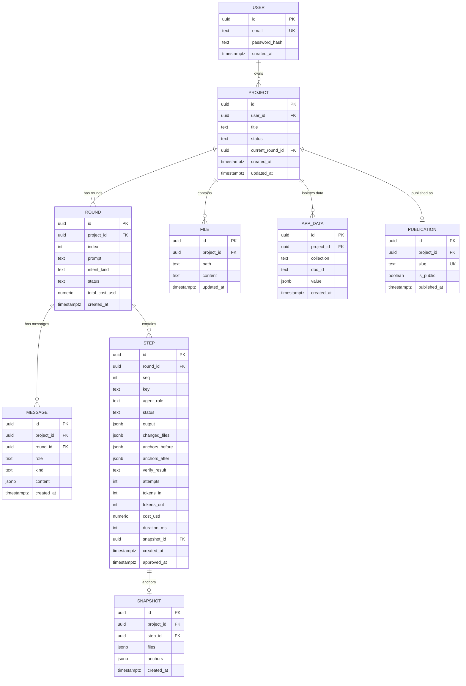
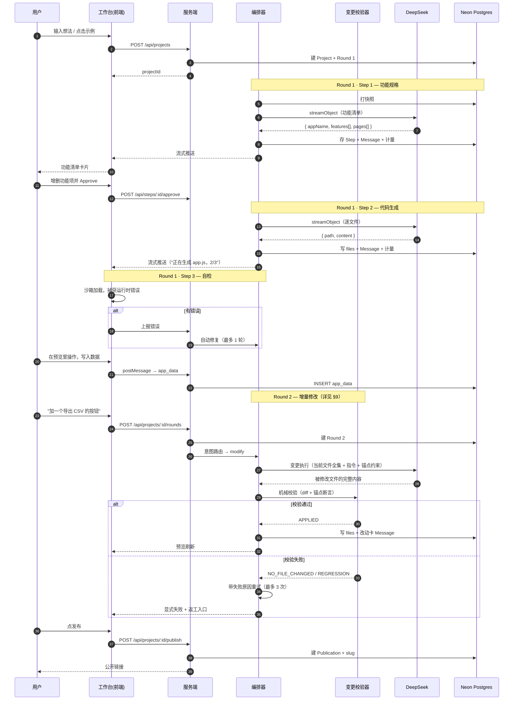

# atoms-lite 落地方案设计

> **文档性质**：开发作战文档
> **配套文档**：《Atoms 平台调研报告.md》
> **版本**：v4.4 · 2026-09-18
> **本版重点**：钉死前台四个面（登录、注册、工作台、个人中心）；右栏是**预览 / 代码 / 终端**三页，终端从 P2 C2 升入 M5；代码仓库定为 `git@github.com:Kane-30/atoms-lite.git`
> **v4.3 重点**：**去掉全部交付时间约束**；钉死「完整可用」交付基线（§0 / §4 / §12.1）；修编排图 publish、Diff 交叉引用、锚点验收措辞等自洽问题
> **v4.2 重点**：补齐「可视化编辑能力不做」的取舍记录（§4.4 W13 + §5.2 D20），并新增 §4.3 C6「主题预设」
> **v4.1 重点**：工作台布局对齐参考产品（§10.2）
> **v4 重点**：代码视图从 Could 提升为 Must（§10.3）
> **v3 重点**：「增量修改的可靠性设计」（§9）与「对话与轮次持久化设计」（§7）
> **成功标准**：做出一个**完整可用**的 atoms-lite（核心 Loop + 两延展 + 全量代码视图），不以工时压缩范围

---

## 0. 一页纸

| 项 | 内容 |
|---|---|
| **名称** | **atoms-lite** |
| **一句话** | atoms-lite 是一个轻量级 AI 原生 Web 应用生成平台：说一句话 → 智能体分步规划 → 生成可运行的应用 → 右侧实时预览 → 继续说一句就能改 → 数据持久化 → 一键发布。 |
| **定位** | 复刻 Atoms 的核心 Loop 与交互体验，不追求能力覆盖 |
| **核心 Loop** | 意图输入 → 蓝图规划 → 人工确认 → 代码生成 → 实时预览 → **增量修改** → 持久化 → 发布 |
| **两个工程重点** | ① **增量修改的可靠性**（§9）② **对话与轮次的完整持久化**（§7） |
| **四个前台面** | 登录、注册、**工作台**（左对话 / 右预览·代码·终端）、**个人中心**（账号 + 项目，不是增长看板）。见 §10.1 |
| **三个界面能力** | ① 双栏工作台（左 28% 对话 / 右 72% 结果，§10.2）② **代码视图**（目录树 + 只读代码，§10.3）③ **版本卡片**（输入框上方的轮次入口）。右栏第三页是**终端**（生成轨迹 + 运行日志，不是系统命令行） |
| **两个延展能力（本次必做）** | ① 步骤产出可编辑并重跑下游 ② 任意步骤 / 任意轮次回滚 |
| **贯穿能力（本次必做）** | 成本 / Tokens 可见 |
| **完整可用基线** | Must（M1–M11，含右栏终端）+ 延展 1/2 + 成本可见；P2 里 C2 已升入 M5，其余 C1、C3–C6 不进本次验收，见 §12.1 |
| **技术栈** | Next.js 15 + TypeScript + Tailwind + shadcn/ui + Drizzle + Neon Postgres + Vercel AI SDK + DeepSeek + iframe 沙箱 |
| **交付** | 在线链接（EdgeOne Pages 主 + Cloudflare Pages 备）+ GitHub `git@github.com:Kane-30/atoms-lite.git` + 说明文档 |
| **现金支出** | ≈ ¥0–10（只充 DeepSeek；详见 §5.8） |

### 核心 Loop

```
① 意图输入        用户说一句话（"帮我做一个记账本"）
        ↓
② 蓝图规划        产出功能清单 → 停下来等确认          ★ 人工介入点
        ↓
③ 代码生成        逐文件生成（流式）
        ↓
④ 实时预览        右侧 iframe 里应用真的跑起来
        ↓
⑤ 增量修改        你说"再加个分类筛选" → 真改了 + 改对了 + 没改坏   ★ 本方案重点
        ↓
⑥ 持久化 & 发布   对话与轮次存下来 + 生成公开链接
```

**这六步就是完整交付范围。** 之外的（真实后端数据库、支付、SEO/Ads、竞速模式、移动端、自定义域名）不做，理由见 §4.4。

### 能力对照

```
                        Atoms 有          atoms-lite 做不做
────────────────────────────────────────────────────────────
对话式生成                ✅               ✅ 做（核心）
多步 Agent 编排           ✅               ✅ 做（核心，3 步）
计划审批                  ✅               ✅ 做（核心）
实时预览                  ✅               ✅ 做（核心）
增量修改                  ✅               ✅ 做（核心 · 重点打磨）
用户注册/登录             ✅               ✅ 做（必需）
对话与轮次持久化          ✅               ✅ 做（核心）
发布 / 分享链接           ✅               ✅ 做（核心）
步骤产出可编辑            ⚠️ 弱            ✅ 做（★ 延展 1）
任意步骤/轮次回滚         ⚠️ 粗（整版快照）  ✅ 做（★ 延展 2）
成本可见                  ❌ 没有           ✅ 做（贯穿）
代码视图（目录树 + 只读）  ✅               ✅ 做（核心 · §10.3）
运行终端 / 控制台         ✅               ✅ 做（核心 · M5，v4.4 从 P2 升入）
点选元素就地编辑          ✅               ❌ 不做
────────────────────────────────────────────────────────────
Auth+DB+支付（给生成的应用）✅              ❌ 不做
SEO / Ads Agent           ✅               ❌ 不做
竞速模式                  ✅               ❌ 不做
移动端 App 生成           ✅               ❌ 不做
自定义域名                ✅               ❌ 不做
代码导出 / GitHub 同步    ✅               🟡 Could
```

---

## 1. 需求清单与验收标准

### 1.1 功能需求

| # | 需求 | 验收标准 | 优先级 |
|---|---|---|---|
| R1 | 实现一个可运行的网页应用，具备类似 Atoms 的能力与 UI 交互体验 | Agent 驱动生成 + 可视化预览两大要素齐备 | P0 |
| R2 | 通过智能体驱动的方式完成代码（应用）生成 | 多步 Agent 流程可见，不是"一句话调一次模型" | P0 |
| R3 | 将生成的应用以可视化网页形式展示 | 生成物在网页里真实运行，不是截图或 mock | P0 |
| R4 | 具备真实交互（而非纯静态展示） | 用户能操作并产生反馈 | P0 |
| R5 | **具备数据持久化** | 见 §1.2 的细化验收标准 | P0 |
| R6 | 基本使用流程（初始化 / 注册 / 核心主流程） | 注册登录 + 核心流程闭环 | P0 |
| R7 | 至少一个延展或衍生能力 | 见 §11 | P1 |
| R8 | 可测试的在线访问链接 | 已部署，**国内网络可直达** | P0 |
| R9 | 实际可用的功能，不仅是概念验证 | 完整任务闭环，不是点几下就断 | P0 |
| R10 | GitHub 源代码链接（public） | public 仓库 + README | P0 |
| R11 | 简要说明文档 | 实现思路 / 完成度 / 扩展计划 | P1 |

### 1.2 「数据持久化」的细化验收标准

> 这一项在同类实现中经常只做一半。这里把它拆成四个层次，**四层全过才算满足**。

| 层次 | 要求 | 验收方法 |
|---|---|---|
| **A. 项目层** | 历史项目完整存储与恢复 | 项目列表可见全部历史项目；打开任一项能完整还原 |
| **B. 对话层** | **对话历史完整保存**（不是部分保存） | 每条消息都持久化：用户消息、Agent 步骤、改动卡、失败与重试记录。刷新 / 换设备 / 登出再登入后依然完整 |
| **C. 轮次层** | **同一 project 的每一轮对话保存为该 project 下的新轮次** | 连续多轮修改始终在同一个 project 下累积，**不新建项目**；轮次列表可浏览、可回到任意一轮 |
| **D. 应用数据层** | 生成的应用自己产生的业务数据也被持久化 | 在预览里写入数据 → 刷新 → 数据还在 |

**明确不做持久化的东西**（避免过度设计）：流式输出中间态、鼠标悬停 / 面板展开态、表单未提交的草稿（仅本地缓存）。

### 1.3 明确要求避免的两类失败模式

> 这两条是本版方案的**核心设计约束**，直接决定了架构与验收标准。

#### 失败模式 A：持久化只做一半

| 表现 | 后果 |
|---|---|
| 只存项目元数据，对话历史丢失 | 刷新后看到项目，但看不到当时怎么聊的 |
| 只保存部分对话（例如只存用户消息，不存 Agent 步骤与失败记录） | 恢复后的上下文不完整，用户无法理解当时发生了什么 |
| **每一轮对话被存成新项目** | 项目列表被轮次污染，失去"一个应用多轮迭代"的语义 |

**对策**：见 §7 的持久化模型 —— Project / Round / Message / Snapshot 四层，全部落库。

#### 失败模式 B：增量修改不可靠

| 表现 | 根因 |
|---|---|
| **F1 只读咨询**：明确要求加功能或改主题，系统只是"讲"了一堆，没有动手 | 把"操作请求"误判成"知识问答"；系统缺少明确的意图路由；模型的默认偏见是"先解释" |
| **F2 静默空操作**：文字声称"已完成"，但文件没有任何变化 | 把模型的**文字陈述**当成了**执行结果**，缺少对产出的机械校验 |
| **F3 回归破坏**：新功能加上了，但顺手弄坏了原有功能 | 修改时只关注新需求，没有对既有功能做保护性约束与验证 |

**对策**：见 §9 —— 四道闸门（意图路由 / 变更计划 / 机械校验 / 重试返工）+ 功能锚点。

> 🔑 **本方案的核心工程原则（贯穿 §7 与 §9）**：
> **只承认文件系统里真实发生了的变化。模型的文字不构成完成证据。**

### 1.4 设计目标（质量属性）

| 属性 | 具体目标 |
|---|---|
| **功能完整性与稳定性** | 核心 Loop 六步端到端无阻断；每步有明确的成功态与失败态；不出现白屏或静默失败 |
| **复杂度控制** | 每个环节只做一条主干路径；不做配置项、不做模式切换、不做高级选项 |
| **用户体验** | 三轮以内上手；每轮操作后都能明确知道"改了什么"；出错时给出可操作项而不是红字 |
| **可扩展性** | 扩展的基础是数据模型而不是散落的分支；新增一步 Agent 只需加一个 schema 与模板 |
| **可交付性** | 从任意时刻中断都有一份可访问的版本；README 能让陌生人从零跑起来 |

---

## 2. 从产品思维拆解 Atoms

### 2.1 Atoms 的核心价值公式

```
用户获得的价值 ≈ (生成质量 × 生成速度) / (经济成本 × 认知成本)
                     ↑           ↑          ↑          ↑
                  模型能力    编排效率   credits   我需要理解多少
                                                 才能用好它
```

Atoms 的发力点清晰：**用多智能体编排把"生成质量"拉高，用开源模型组合把"经济成本"压到竞品的约 1/5。** 这是一个非常聪明的商业定位。

### 2.2 用户与 JTBD

| 用户 | 表层需求 | 真实 JTBD | 未被满足的焦虑 |
|---|---|---|---|
| 非技术创业者 | "帮我做个网站" | 在**不投入人力**的前提下验证想法能不能赚钱 | 做出来的东西**靠谱吗**？会不会白花钱？ |
| 小微业主 | "把三个 App 合成一个" | 把业务流程**固化**成可维护的系统 | 后面要改怎么办？**我改得动吗**？ |
| 外包开发者 | "快点交付客户站点" | 用更低成本完成**可交付**的活儿 | 交付边界**清不清楚**？ |
| 产品型开发者 | "跳过 boilerplate" | 把时间花在**只有我能做**的地方 | 我被**绑死**在这个平台上了吗？ |

**归纳出的三个共同焦虑**：

```
焦虑 1  「我凭什么相信它做对了？」        → 过程可检查的中间产物
焦虑 2  「改一个地方要花多少钱、多少时间？」 → 增量修改的确定性
焦虑 3  「这东西最后属于我吗？」           → 数据可导出、格式开放、无锁定
```

> **关键观察**：焦虑 1 和焦虑 2 都指向同一件事——**"改动"这件事的确定性**。
>
> 生成第一次是"惊喜"，改第二次开始就是"信任"问题。而信任问题的失败方式很具体：**要么它没改，要么它说改了其实没改，要么它改好了但把别的弄坏了。**
>
> **这正是 §9 要解决的问题，也是本方案把最多工程投入放在"增量修改"而不是"首次生成"的原因。**

### 2.3 Atoms 的四个关键设计决策（指导本方案取舍）

理解一个产品最好的方式，是还原它做过的取舍。以下四个决策直接影响了 atoms-lite 的设计。

#### 决策 1：为什么是「拟人化 Agent 团队」而不是「一个更强的 Agent」？

| | 多智能体团队 | 单体强 Agent |
|---|---|---|
| 优势 | 上下文更聚焦 → 省 token；可并行；可解释（谁在做什么） | 实现简单、延迟低、无交接损耗 |
| 劣势 | 交接损耗、编排复杂度 | 长上下文污染、单点失败、黑盒 |
| **Atoms 赌的是** | **现实世界的复杂任务本来就是团队协作完成的**，所以模拟团队 > 强化个体 | |

> **产品洞察**：这不只是技术选择，更是**叙事选择**。拟人化团队给了用户一个熟悉的心理模型（"我在带一个团队"），让"审批 / 汇报 / 进度"这些交互变得**天然合法**。如果只是一个"更强的 AI"，这些交互就没有立足点。
>
> **对本方案的启示**：每个步骤卡片必须**显示 Agent 角色**（"产品经理 · 正在拆解需求"），而不只是一个进度条。这是零成本的叙事增益。

#### 决策 2：为什么是「计划审批制」而不是「全自动」？

Atoms 在写第一行代码之前，会把任务清单交给你 Approve。

> **取舍逻辑**：全自动的体验上限更高（零打扰），但**失败成本也更高**（方向错了要重来一遍，烧掉大量 credits）。审批制牺牲一点流畅度，换取**方向对齐的确定性**。
>
> 背后是一条通用原则：**把人工介入放在"纠正成本即将急剧升高"的那个点上。**
>
> **对本方案的启示**：把审批点放在功能清单产出之后、代码生成之前。这是**唯一**的审批点——多一个审批点就是多一次流失机会。

#### 决策 3：为什么是「Preview-first」而不是「Code-first」？

Atoms 把预览区放在视觉中心，代码编辑器是次要入口。

> **取舍逻辑**：目标用户是"不写代码的人"，所以**验证介质必须是他们能看懂的东西**。代码对他们不是可信度，而是噪音。
>
> **对本方案的启示**：右栏默认停在预览，代码视图作为与预览**平级的第二个 Tab**放在同一区域。这样既守住"验证介质是用户能看懂的东西"，又让"生成物到底是什么"随时可查——**代码在视野里，但不在视觉中心。**（设计见 §10.3）

#### 决策 4：为什么要有竞速模式？

> **取舍逻辑**：LLM 输出有方差，多模型竞速是**用成本换确定性**的朴素手段。
>
> **但它粒度太粗**：整条流程跑 N 遍，成本是 N 倍。而用户真正纠结的往往只是一两个决策点。
>
> **对本方案的启示**：不做整流程竞速。用**"机械校验 + 重试"**来换确定性，成本是常数级而不是 N 倍——这是更划算的确定性来源（见 §9）。

### 2.4 从 Atoms 提炼的「最小可信内核」

```
┌──────────────────────────────────────────────────────────────┐
│                                                              │
│   ① 说人话就开工          ② 能看见它的进展                     │
│   零门槛输入               结构化进度 + 可读的过程              │
│                                                              │
│   ③ 结果真的跑起来        ④ 我能接着改，而且改得住              │
│   真预览、真交互           改得动 + 改得对 + 改不坏             │
│                                                              │
│   ⑤ 我做的东西能留下来                                        │
│   真持久化 + 真发布                                            │
│                                                              │
└──────────────────────────────────────────────────────────────┘
```

**① 和 ③ 是"能不能用"，④ 是"敢不敢用"。** 前三项做通只到及格线；第 ④ 项做稳了，产品才真的可信。**本方案的工程重心放在 ④。**

---

## 3. 定位

### 3.1 一句话

> ## 把 Atoms 的核心 Loop 做薄、做通、做得可靠。

| 关键词 | 含义 | 反面 |
|---|---|---|
| **做薄** | 每个环节只做一条最主干路径，不做分支、不做配置、不做高级模式 | 功能列表很长但每个都半成品 |
| **做通** | 六步闭环端到端无阻断，每一步都有明确的成功态 | 演示到第三步卡住 |
| **做得可靠** | 尤其是增量修改——改得动、改得对、改不坏 | "能跑，但改一次崩一次" |

### 3.2 为什么选"复刻"而不是"差异化"

曾经考虑过一个更锋利的定位：只做"生成过程的可解释性"。**被否决了**，理由值得记录：

| 维度 | 差异化定位 | 复刻定位 ✅ |
|---|---|---|
| 叙事 | 更锋利 | 更朴素、更诚实 |
| 风险 | **需要额外论证"为什么这个轴重要"**；如果这个前提不成立，整套设计都成了自嗨 | 低。核心 Loop 是客观存在的，做通就是做通 |
| 实现复杂度 | 需要状态机 + 快照 + 依赖推导 + 完整的 diff 视图与双向同步，**复杂度显著更高** | 复杂度可控，且与需求正向对齐 |
| 与需求的关系 | 回答了一个没被问的问题 | 正面回答"具备类似 Atoms 的能力与 UI 交互体验" |

> **判断依据**：需求写的是"具备类似 Atoms 的能力与 UI 交互体验"。**复刻核心闭环是对需求的正面回答，刻意差异化反而是在回答一个没被问的问题。**
>
> 但这不等于"没有自己的东西"——**真正的贡献放在工程可靠性上**：把"增量修改"这件行业内普遍做不稳的事做稳（§9）。这是产品能力的深化，而不是叙事上的标新立异。

### 3.3 这个定位的代价

必须诚实面对：**"复刻核心闭环"在观感的新颖性上天然吃亏**——凡是熟悉 Atoms 的人，都能一眼看出这是同一个思路。

所以本方案的贡献点集中在三处，都是**可验证的工程与设计判断**，而不是叙事：

| 贡献点 | 为什么它是真实的贡献 |
|---|---|
| **增量修改的执行闭环**（§9） | 这是同类产品普遍的不稳定点。用"机械校验 + 功能锚点 + 重试返工"把它做成确定性的，是真实的工程工作 |
| **对话与轮次的完整持久化**（§7） | 四层模型（Project / Round / Message / Snapshot），语义清晰、可恢复、可回溯 |
| **成本可见** | Atoms 没有的能力，实现成本极低，直接回应用户焦虑 |

**这个取舍会写进说明文档**：我知道"复刻"不占观感优势，我的选择是把精力压在**可靠性**上，而不是用一个自己都没时间验证的差异化定位去赌。这本身就是一种工程判断。

---

## 4. 功能范围

### 4.1 必须做（P0）

| # | 功能 | 验收标准 |
|---|---|---|
| M1 | 邮箱 + 密码注册 / 登录 | 能注册、能登录、刷新后 session 保持、能登出 |
| M2 | 项目初始化与项目列表 | 登录后能创建项目；列表能看到全部历史项目并完整还原 |
| M3 | Prompt 输入 + 预置示例一键填充 | 首页大输入框 + 3 个可一键填充的示例（待办清单 / 记账本 / 习惯打卡） |
| M4 | 多步 Agent 流水线（首次生成） | 三步：功能规格 → 代码生成 → 自检；全程结构化流式输出 |
| M5 | 双栏工作台 | 左栏（窄）：对话 + 步骤卡片（Agent 角色 / 状态 / 产出摘要 / 成本），**已完成的步骤折叠为一行「已处理 N 步」可展开**；右栏（宽）：**预览 / 代码 / 终端**三页 + 工具条（见 §10.2）。终端不是系统 shell |
| M6 | 计划审批 | 功能清单产出后暂停，用户可增删功能项，确认后才开始写代码 |
| M7 | 沙箱预览 | 生成的应用在 iframe 里真实运行、可点击交互 |
| M8 | **对话与轮次持久化** | 见 §1.2 的 A/B/C/D 四层验收标准，**四层全过** |
| M9 | **增量修改（可靠性重点）** | 明确要求加功能 / 改主题 / 改布局 / 修可见问题时：**真改了 + 改对了 + 原功能保留 + 未完成会重试或显式失败**（见 §9） |
| M10 | 一键发布 + 公开链接 | 生成稳定 slug URL，未登录也可访问 |
| M11 | **代码视图（只读）** | 右栏可切到代码：**展示生成的代码目录结构** + 逐文件只读查看（语法高亮、行号、复制）；**任何入口都不能手动编辑**（见 §10.3） |

### 4.2 应该做（P1 · 延展能力 · **本次完整可用基线必含**）

| # | 功能 | 验收标准 |
|---|---|---|
| S1 | **★ 步骤产出可直接编辑** | 点开功能清单卡片可增删功能项；保存后提示重跑范围与预计代价，确认后重跑 |
| S2 | **★ 任意步骤 / 任意轮次回滚** | 点"回到这里"，项目回退到该快照，之后的状态标记为可重跑 |
| S3 | **★ 成本 / Tokens 可见** | 每一步显示 tokens 与成本；顶栏显示本轮与累计成本 |

### 4.3 可以做（P2 · **不进本次完整可用验收**；架构兼容、有需要再加）

| # | 功能 | 说明 |
|---|---|---|
| C1 | 导出为单个 HTML 文件 / zip | 呼应"无锁定"叙事。**入口放在代码视图文件树的底部**（"下载项目"），位置天然（§10.3） |
| C2 | **运行终端** | **v4.4 起不再是 P2。** 已升入 M5：右栏第三页，展示本轮校验结论、步骤轨迹、预览运行日志。不是系统命令行，也不做「设计」页 |
| C3 | 移动端响应式适配 | 加分但不必须 |
| C4 | 分享面板带二维码 | 演示时好看 |
| C5 | 完整 Diff 对比视图 | 本轮只做"改动行标记"（§10.3），并排对比面板放这里 |
| C6 | **主题预设（走唯一写路径）** | 3–5 套预置配色，选中后**作为一条普通的增量修改指令**交给编排器（"把主色换成：--primary #059669、--bg #f8fafc…"）。**不新增写路径、不需要 DOM→源码映射，且"改了没生效"会被 §9.4 的机械校验拦住并重试**——这是"主题能力"里唯一与本方案架构一致的做法（见 §5.2 D20） |

### 4.4 不做（明确排除）

| # | 不做 | 理由 |
|---|---|---|
| W1 | 为生成的应用开通真实数据库 / 用户系统 | 需要多租户建表或 schema 隔离，涉及迁移、清理、注入防护一整套链路，会挤占主线时间 |
| W2 | 支付集成 | Atoms 的商业化能力，不是核心 Loop |
| W3 | SEO / Ads Agent | 同上 |
| W4 | **整流程或多方案竞速** | 模型成本与延迟翻倍，还要同时渲染多套预览；用"机械校验 + 重试"换确定性成本更低（见 §2.3 决策 4） |
| W5 | 依赖推导图 / 最小重算集合 | 需要维护"文件 ↔ 功能项"的映射表，实现成本约 5 倍。**改为按文件粒度整体重跑**——可理解，成本 1/5 |
| W6 | 分叉（fork） | 回滚与轮次切换已满足试错需求 |
| W7 | 自定义域名 | 需要域名 + DNS + 备案，时间成本极高（部署用平台免费子域名即可，见 §5.7） |
| W8 | 移动 App 生成 | 超出 Web 范围 |
| W9 | 多语言 i18n | 中文单语言足够 |
| W10 | 团队协作 / 多用户共享项目 | 权限模型是独立的大工程 |
| W11 | 生成 React/Vue 源码（需构建） | 需要构建沙箱，失败率与调试成本相对纯静态产物不可控（见 §5.2 D2） |
| W12 | 项目广场 / Remix | 需要额外的浏览、审核、复制链路，性价比低 |
| **W13** | **Visual Editor（点选元素就地改样式）与主题系统（Theme）** | **本方案只有一条写路径：对话。** ① 第二条写路径立刻要回答"手改的样式下一轮保留还是覆盖"的冲突合并问题 ② 点选编辑需要一棵「DOM → 源码位置」的映射索引树，**与 W5 砍掉的依赖推导图是同一类东西** ③ 主题系统要求生成产物真有令牌层，否则会出现**"控件能动、页面不变"**——把一种新的静默失败引入到一个以可靠性为核心命题的方案里。**若确需主题能力，正确做法是 C6 主题预设**。详见 §5.2 D20 |

### 4.5 范围收敛原则

> **凡是不能服务于"核心 Loop 跑通且可靠"的功能，一律不做。**

---

## 5. 技术方案与架构

### 5.1 总体架构

```
┌───────────────────────────────────────────────────────────────────────────┐
│                            浏览器（Next.js App）                           │
│                                                                           │
│  ┌────────────────────────┐   ┌────────────────────────────────────────┐  │
│  │  左栏：对话 + 步骤卡片   │   │  右栏：实时预览                         │  │
│  │  ─────────────────     │   │  ─────────────────────────────          │  │
│  │  👤 做一个记账本        │   │  ┌──────────────────────────────────┐  │  │
│  │                        │   │  │  iframe sandbox                  │  │  │
│  │  ● 功能规格   ✓ ¥0.01  │   │  │  生成的应用真实运行               │  │  │
│  │  ● 代码生成   ◐ ¥0.28  │   │  │  ↕ postMessage                   │  │  │
│  │  ○ 自检      等待      │   │  └──────────────────────────────────┘  │  │
│  │                        │   │                                        │  │
│  │  👤 加个导出按钮        │   │  [桌面] [手机]   ⟳   ↗                │  │
│  │  ⟳ 第 2 轮 已改 2 文件 │   │                                        │  │
│  │                        │   │                                        │  │
│  │  ┌──────────────────┐  │   │                                        │  │
│  │  │ 继续说你想改什么… │  │   │                                        │  │
│  │  └──────────────────┘  │   │                                        │  │
│  └────────────────────────┘   └────────────────────────────────────────┘  │
│                     ▲                              ▲                      │
│                     │        流式事件流             │                      │
└─────────────────────┼──────────────────────────────┼──────────────────────┘
                      │                              │
┌─────────────────────┴──────────────────────────────┴──────────────────────┐
│                     Next.js 服务端（Route Handlers / Server Actions）       │
│                                                                           │
│  ┌───────────┐ ┌──────────────────┐ ┌───────────┐ ┌──────────────────┐   │
│  │  认证      │ │  编排器           │ │  仓储层    │ │  变更校验器 ★     │   │
│  │  session  │ │  Orchestrator    │ │  Drizzle  │ │  Verification    │   │
│  │  bcrypt   │ │  ── 状态机        │ │  ORM      │ │  ── diff 判定     │   │
│  └───────────┘ │  ── 意图路由 ★    │ └───────────┘ │  ── 锚点断言      │   │
│                │  ── Prompt 模板   │               │  ── 重试策略      │   │
│                │  ── zod 校验      │               └──────────────────┘   │
│                │  ── 重试/降级      │                                      │
│                └────────┬─────────┘                                      │
│                         │  用 Vercel AI SDK 统一调用与流式                 │
└─────────────────────────┼─────────────────────────────────────────────────┘
                          │
          ┌───────────────┼───────────────┐
          ▼                               ▼
┌──────────────────┐          ┌────────────────────────┐
│  LLM Provider    │          │  Neon Postgres         │
│  DeepSeek (主)   │          │  ── users              │
│  + 备选 1 家     │          │  ── projects           │
│  OpenAI 兼容协议 │          │  ── rounds  ★          │
└──────────────────┘          │  ── messages ★         │
                              │  ── steps              │
                              │  ── files              │
                              │  ── snapshots          │
                              │  ── app_data  ★        │
                              │  ── publications       │
                              └────────────────────────┘
```

### 5.2 关键技术决策与取舍记录

| # | 决策点 | 选择 | 备选方案 | 为什么这么选 | 代价 |
|---|---|---|---|---|---|
| **D1** | 框架 | **Next.js 15 App Router**（全栈一体） | Vite + React + 独立 Express | 一个仓、一套类型、一条部署流水线 | 绑定 Next.js 生态（可接受） |
| **D2** | 生成物形态 | **纯 HTML / CSS / JS 多文件**（可用白名单 CDN） | 生成 React/Vue 源码 | React 需要构建管线（esbuild/swc-wasm），沙箱内编译的失败率和调试成本相对不可控。**纯静态产物零构建直接运行** | 生成的应用复杂度有上限（足够覆盖表单/列表/图表/看板类） |
| **D3** | 渲染方式 | **`<iframe srcdoc sandbox="allow-scripts">`** | ① Sandpack ② 为每个项目真实部署到子域名 | ① Sandpack 依赖 CodeSandbox 托管服务做依赖打包，**国内可达性存疑 + 集成与调试成本高**，收益不匹配 ② 真实部署链路是独立大工程。srcdoc **零运维、秒级生效** | iframe 内有能力限制（需 bridge，见 D4） |
| **D4** | 平台能力注入 | **`postMessage` bridge**，向沙箱注入 `window.atomslite.*` SDK（`db.get/set/list`、`toast`） | 让生成的代码直接 `fetch` 平台 API | ① 生成的代码**不应持有任何凭据** ② 平台可**审计**生成应用的每次数据访问 ③ 换实现不影响生成代码 | 需设计一套稳定的 bridge 协议 |
| **D5** | 生成应用的数据 | **统一租户表 + project 命名空间隔离**（`app_data(project_id, collection, doc_id, value)`） | 为每个项目动态建表 | 动态 DDL 需权限、迁移、清理、注入防护，风险远大于收益 | 单表数据量大时需分区（当前规模无问题） |
| **D6** | Agent 编排 | **自研显式状态机**（~250 行） | LangChain / LangGraph / CrewAI | ① 学习与调试成本高于收益 ② **本流程是线性 + 一个暂停点，框架的抽象成本大于收益** ③ 显式状态机让"校验 / 重试"能被精确插入 | 需自己处理重试（规模极小，可控） |
| **D7** | LLM 输出约束 | **JSON Schema 强制 + zod 校验 + 自动重试 + 兜底模板** | 自由文本解析 | 生成代码对格式极度敏感。**schema 校验把无穷的失败模式收敛到可处理区间** | 需为每个步骤精心设计 schema（主要工作量） |
| **D8** | 流式方案 | **Vercel AI SDK**（`streamObject` / `generateObject` + `useObject`） | 手写 SSE + 前端状态机 | ① 直接给出**结构化流式输出 + React hook**，显著降低手写流式状态机成本 ② 内置 usage 回调，**成本计量天然可接** ③ 更容易不出 bug | 多一层抽象；需确认 DeepSeek 的 JSON 模式兼容性（列入 §12.2 POC） |
| **D9** | 认证 | 自研：邮箱 + bcrypt + HttpOnly Cookie Session | Auth.js / Clerk / 第三方 Auth | 目标只有"能注册能登录"，**引入第三方 Auth 的配置 / 回调 / 环境变量调试时间 > 自研时间** | 不支持 OAuth（写进不做清单） |
| **D10** | ORM / DB | **Drizzle ORM + Neon Postgres**，配 **Neon serverless driver** | Prisma / SQLite | Drizzle 轻、类型好、serverless 冷启动友好；**Neon serverless driver 走 HTTP/WebSocket，避免无服务器环境下的连接池耗尽** | 需要网络（本地用 Docker Postgres 或 Neon 分支兜底） |
| **D11** | **修改机制** | **文件级：把当前文件全集 + 指令交给模型，产出「被修改文件的完整内容」；平台自己算 diff** | ① 依赖推导只重算受影响文件 ② 让模型输出 patch | ① 依赖推导成本 5 倍而收益极小 ② **让模型输出 patch 是 F2 的主要来源**——patch 应用失败或模型虚构上下文都会造成"声称完成但文件没变"。**让模型输出完整文件内容，diff 由平台计算，结果可机械验证** | 输出 token 更多（单文件量小，可接受） |
| **D12** | **完成判定** | **机械校验**：路径级 diff + 内容级 diff（忽略空白）+ 功能锚点断言 | 相信模型的文字回复 | **这是 §9 的核心。模型说完成了不算，文件变了才算** | 需要锚点机制（见 D14） |
| **D13** | **失败处理** | **三级重试链 + 显式返工入口**，绝不静默通过 | 失败就报错 | 需求明确要求"让'未完成'结果能够进入重试或返工"。且重试必须**带上上一轮的失败原因**，否则等于重掷骰子 | 单次修改最多 3 次调用 |
| **D14** | **回归保护** | **功能锚点**：生成时代码须为每个功能加 `data-feature="<id>"`；每轮修改后断言锚点集合不缩小（被声明的移除除外） | 靠 prompt 叮嘱"不要破坏原有功能" | **提示词不是保证，断言才是。**锚点检查是确定性的、不花 token 的、可解释的 | 需在 code 步骤的 prompt 里强制该约定 |
| **D15** | 成本计量 | 从 AI SDK 的 `onFinish` 累计 usage，按模型单价换算，写入 Step 行 | 事后统计 | 成本可见是明确的差异化能力，必须是一等公民 | 需维护单价表 |
| **D16** | **部署** | **EdgeOne Pages（腾讯云）主 + Cloudflare Pages 备** | Vercel | `*.vercel.app` 在**国内网络经常直接打不开**，提交链接必须国内可直达 | EdgeOne 对 Next.js 的适配与 Vercel 有差异，需提前验证（列入 §12.2 POC） |
| **D17** | **代码视图的形态** | **只读**：文件树（由 `FILE.path` 构建）+ 语法高亮 + 行号 + 一键复制 + **"引用到对话"**；改动行标记（复用 §9.4 的 diff 结果） | ① 可编辑的在线 IDE ② 只展示当前单文件、不给目录结构 ③ 不做代码视图 | ① **可编辑会引入"手改 vs 生成"的冲突合并问题**，并把产品拉向弱化版 IDE（见 §4.4 W13）② **目录结构本身就是"这个应用由什么构成"的答案**，只给一个文件不够 ③ 代码不可见时，用户对 F2（声称改了其实没改）只能选择相信；**代码可见是"可信"的最低成本来源** | 需为生成产物约定可被 `srcdoc` 组装的路径（见 D19） |
| **D18** | **代码高亮方案** | **`highlight.js`**（纯 npm 包，只注册 html/css/js 三种语言） | Shiki / Prism CDN / 不做高亮 | 与 D3 拒绝 Sandpack 是**同一条原则：不引入任何运行时外部依赖**。Shiki 质量更好但体积大、依赖 wasm 与 CDN，国内加载不可控 | 高亮质量略逊于 Shiki（对 3 种语言的观感差异可忽略） |
| **D19** | **生成产物的文件组织** | 模型可输出多级相对路径（**约束 ≤ 2 层**），`srcdoc` 组装器做**通用相对路径解析 + 内联** | 固定平铺 3 个文件（index.html / styles.css / app.js） | 目录结构是 D17 的必要输入；通用解析器约 30 行，成本可控。约束层数是为了让文件树在窄栏里可读 | 组装器需处理 `./` `../` 与缺失文件的容错 |
| **D20** | **可视化编辑能力（Visual Editor / 主题系统）** | **不做。** 若确需"换主题"，走**主题预设**：3–5 套预置配色，选中后作为一条**普通增量修改指令**交给编排器（§4.3 C6） | ① Visual Editor（点选元素就地改样式）② 真正的 Theme 系统（结构化令牌面板 + 实时生效）③ 完全不提供任何主题能力 | ① **与 D17 同源：本方案唯一的写路径是对话。** 第二条写路径立即产生"手改的样式下一轮是否保留""AI 说改了主题，但它改的是内联样式还是 CSS 变量"这类问题——**冲突合并的复杂度高于功能本身** ② 点选编辑的隐性成本是一棵「DOM → 源码位置」映射索引树（点一个 `<button>`：要改的是 HTML 的 class、CSS 的规则、还是 JS 里内联的 style？）——**与 W5 砍掉的依赖推导图是同一类东西**，砍了 W5 却做它自相矛盾 ③ Theme 系统的前提是生成产物真有令牌层（prompt 强约束 + 校验断言"无写死颜色值"），否则结果是**"控件能动、页面不变"**，正好是 F2 的另一种形态 ④ **主题预设绕开以上全部**：不新增写路径（仍走 §9 的四道闸门）、不需映射树、**"改了没生效"会被 §9.4 机械校验拦住并重试** | 主题能力的交互不如真 Theme 系统实时；用户想"点哪改哪"仍只能用文字描述 |

**被明确否决的方案**：

| 否决的方案 | 否决理由 |
|---|---|
| **部署到 Vercel 作为主链接** | 国内网络经常无法访问。**这是最容易让全部努力归零的一个决定** |
| **用 Sandpack 做预览沙箱** | 依赖 CodeSandbox 托管服务打包依赖，国内可达性存疑；集成与调试成本高。`iframe srcdoc` 免费、原生、零运维 |
| 生成 React + 沙箱内 esbuild 编译 | 失败率高、报错难懂、调试时间不可控 |
| 用 LangGraph 做编排 | 框架的价值在复杂拓扑；本流程是线性 + 一个暂停点 |
| **让模型输出 patch / diff 而不是完整文件** | patch 的解析与应用是"静默失败"的主要来源（见 §9.2 F2） |
| **靠 prompt 叮嘱"不要破坏原有功能"** | 提示词是概率性的，断言是确定性的。回归保护必须机械化 |
| **Visual Editor 点选编辑 / 真正的 Theme 系统** | 引入第二条写路径，以及「DOM → 源码位置」映射索引树（与砍掉的依赖推导图同类）；且 Theme 系统的隐性风险是"控件能动、页面不变"这种新的静默失败（§5.2 D20） |
| 为每个生成的应用开真实数据库 | 多租户 DDL / 迁移 / 清理链路是独立工程，收益远小于风险 |
| 做整流程竞速 | 成本 N 倍、延迟 N 倍 |
| 依赖推导图 | 实现成本约 5 倍，收益极小 |
| 分叉（fork） | 回滚与轮次切换已满足需求 |
| 用 LocalStorage 作为持久化主方案 | 清缓存即丢失、无法多端。**可以当本地缓存，但不能作为"数据持久化"的方案** |

### 5.3 技术栈清单

| 层 | 选型 | 费用 |
|---|---|---|
| 语言 | **TypeScript**（strict） | 免费 |
| 框架 | **Next.js 15**（App Router） | 免费（开源） |
| UI | **Tailwind CSS + shadcn/ui** | 免费（开源） |
| 面板布局 | **shadcn/ui Resizable Panel**（不自研拖拽） | 免费 |
| 状态 | React `useState` / `useReducer` + AI SDK 的 `useObject` | 免费 |
| 流式与 LLM 编排 | **Vercel AI SDK**（`ai` + `@ai-sdk/deepseek`） | 免费（开源 npm 包） |
| **LLM** | **DeepSeek**（Flash 为主，Pro 用于难步骤） | **按量付费（唯一必付项）** |
| LLM 备选 | 任意 OpenAI 兼容端点（阿里百炼 / 智谱 GLM），**通过 `baseURL` 配置，不写死** | 免费额度或按量 |
| DB | **Neon Postgres**（Free 档）+ **Drizzle ORM** + Neon serverless driver | 免费档够用 |
| 认证 | 自研 session（bcrypt + HttpOnly Cookie） | 免费 |
| 校验 | **zod** | 免费（开源） |
| 沙箱 | `iframe srcdoc` + `postMessage` | 免费（浏览器原生） |
| 部署 | **EdgeOne Pages（主）+ Cloudflare Pages（备）** | 免费档够用 |

### 5.4 编排器设计

**步骤定义**（三步）：

```typescript
type StepKey =
  | 'spec'       // 功能规格：做什么（产出功能清单，等待审批）
  | 'code'       // 逐文件生成代码
  | 'validate';  // 自检：沙箱加载，捕获运行时错误

type StepStatus =
  | 'pending'
  | 'running'
  | 'waiting_approval'   // 唯一的人工介入点
  | 'done'
  | 'failed';
```

**编排流程**：

```
                     ┌─────────────┐
   用户 Prompt  ────▶│   spec      │  产出：{ appName, features[], pages[] }
                     └──────┬──────┘
                            │  ★ 暂停 → 用户 Approve / 增删功能项
                            ▼
                     ┌─────────────┐
                     │   code      │  逐个文件生成 → 写 files 表 → 流式推进度
                     └──────┬──────┘
                            │
                            ▼
                     ┌─────────────┐
                     │  validate   │  沙箱加载 → 捕获 console.error / onerror
                     └──────┬──────┘
                       有错误 │  最多自动修复 1 轮
                            ▼
                     ┌─────────────┐
                     │  ready      │  预览可用；等待用户继续改或主动发布
                     └─────────────┘

  ★ 发布是独立用户动作（非编排末步）：
    用户点「发布」→ POST /api/projects/:id/publish → 写 publications + slug

  ★ 增量修改走独立入口（第 2 轮及以后）：
    意图路由 → 变更计划 → code（增量模式）→ 机械校验 → 应用 / 重试
    详见 §9
```

**每一步的统一执行契约**：

```typescript
async function executeStep(step: Step, ctx: RunContext) {
  // 1) 打快照（回滚锚点）—— 在动手之前
  const snapshot = await snapshotService.capture(ctx.projectId, step.id);

  // 2) 组装上下文：只带这一步需要的输入
  const prompt = buildPrompt(step.key, ctx);

  // 3) 用 AI SDK 做结构化流式调用
  const result = streamObject({
    model: deepseek('deepseek-v4-flash'),
    schema: SCHEMAS[step.key],       // zod
    prompt,
    onFinish: ({ usage }) => repo.steps.meter(step.id, usage),  // 成本计量
  });

  // 4) 落库
  const data = await result.object;
  await repo.steps.complete(step.id, { output: data, snapshotId: snapshot.id });

  // 5) 需要人工确认则挂起
  if (step.key === 'spec' && !ctx.autoApprove) {
    await repo.steps.setStatus(step.id, 'waiting_approval');
    return { paused: true };
  }
}
```

**Prompt 设计要点**：

| 步骤 | 关键约束 |
|---|---|
| `spec` | 输出**严格 JSON**；功能项 **≤ 6 个**（控制范围蔓延）；每项必须有明确验收描述；页面 ≤ 3 个 |
| `code` | **单文件生成**（不要一次生成全部）；强约束：**`index.html` 为入口，其余文件用相对路径且最多 2 层目录**（如 `styles/main.css`、`scripts/app.js`）、不需要构建、只用原生 API + 白名单 CDN、**必须通过 `window.atomslite.db` 读写数据**、**必须为每个功能对应的 UI 元素加 `data-feature="<feature-id>"`**、必须包含空状态、移动端可用 |
| `code`（增量模式） | 输入是"当前文件全集 + 本轮指令 + 上轮失败原因（如有）"；**必须输出被修改文件的完整内容**；若无法完成必须显式返回 `{ status: 'cannot', reason }`；**不得删除未在本轮指令中提及的 `data-feature` 标记** |
| `validate` | 输入错误堆栈 + 相关文件；**只输出需要修改的文件** |

### 5.5 沙箱与 Bridge 设计

`iframe srcdoc` + `sandbox="allow-scripts"` 的沙箱里，生成的代码**不能访问平台后端**（也不该访问——它不该持有凭据）。但持久化要求"生成的应用数据也要存下来"，所以需要一个受控通道。

```
┌───────────────────────────────┐         ┌──────────────────────────────┐
│  父页面（atoms-lite 工作台）   │         │  iframe sandbox              │
│                               │         │  （生成的应用）               │
│  postMessage 监听器           │◀────────│  window.atomslite.db.list(…) │
│         │                     │  请求    │         │                    │
│         ▼                     │         │         ▼                    │
│  校验 origin / projectId      │         │  postMessage 桥接 SDK        │
│  鉴权：这个 project 归谁？     │         │  （注入到沙箱的 <script>）     │
│         │                     │         │                              │
│         ▼                     │         │                              │
│  Postgres: app_data 表        │─────────▶│  返回 { ok: true, data }     │
│  WHERE project_id = ?         │  响应    │                              │
└───────────────────────────────┘         └──────────────────────────────┘
```

**注入给生成应用的 SDK（对模型的"技术栈契约"）**：

```javascript
window.atomslite = {
  db: {
    list(collection)                  // → Promise<Array>
    insert(collection, doc)           // → Promise<doc>
    update(collection, id, patch)     // → Promise<doc>
    remove(collection, id)            // → Promise<void>
  },
  toast(message),
  ready()                             // 通知平台"我加载完了"
};
```

**三个设计好处**：

1. **安全**：生成的代码永远拿不到平台凭据或数据库连接串
2. **可审计**：平台能记录生成应用的每次数据访问
3. **可移植**：`window.atomslite` 是**稳定的抽象层**。未来换成真实后端或第三方 BaaS，生成的应用代码一行都不用改

**沙箱硬约束**：

```html
<iframe
  sandbox="allow-scripts allow-forms"   <!-- 故意不给 allow-same-origin -->
  referrerpolicy="no-referrer"
/>
```

- 不给 `allow-same-origin` → 沙箱无法访问父页面 DOM / Cookie / localStorage
- 不给 `allow-top-navigation` → 防止生成的应用劫持整个页面
- CDN 白名单 → 防止随意加载任意脚本。**默认允许**：`cdn.jsdelivr.net`、`unpkg.com`、`esm.sh`（仅 https）；组装器在内联前校验 `<script src>` / `<link href>`，白名单外的引用 → validate 报错并拒绝发布预览

**多文件 → `srcdoc` 的组装器**（`FILE` 全集 → 单文档字符串）：

```
输入：FILE[] = [{ path: 'index.html', content }, { path: 'styles/main.css', content }, ...]

① 以 index.html 为入口，取其 content 作为骨架
② 扫描 HTML 里的引用：
     <link rel="stylesheet" href="styles/main.css">   → 换为 <style>…</style>
     <script src="scripts/app.js"></script>           → 换为 <script>…</script>
③ 路径解析：按 HTML 文件所在目录解析相对路径（支持 ./ 与 ../），最多 2 层
④ 注入 bridge SDK 的 <script>（在业务脚本之前）
⑤ 逐个替换；**引用但缺失的文件不静默丢弃**——注入一段可见的告警注释并在 validate 步报错
```

> **为什么要有这一步**：`srcdoc` 是单文档，但产物是多文件且带目录。这层组装器同时服务三处——预览、发布页、以及代码视图（**代码视图读的是 `FILE` 全集，不是 `srcdoc`**，所以看到的就是真实文件，而不是内联后的产物）。这也是 §12.2 POC 3 要一起验证的原因。

### 5.6 本地开发与"始终可部署"原则

```
开发纪律：
  第 1 步就先把"空壳"部署上去，之后再逐步加功能。
  任何时刻中断，线上都有一份可访问的版本。

分支策略：
  main        → 自动部署（永远是可演示状态）
  dev/xxx     → 功能开发分支

理由：
  限时项目最大的交付风险是"最后才发现部署不通"。
  先把部署链路跑通，再填功能。
```

### 5.7 部署方案

> ⚠️ 这一节是本方案风险最高的部分。

**各平台国内可达性**：

| 方案 | 国内可达性 | 免费额度 | Next.js 全栈支持 | 结论 |
|---|---|---|---|---|
| **EdgeOne Pages**（腾讯云） | 🟢 **最好**。未备案域名：国内约 670–1400ms；**备案域名可启用国内节点，50–90ms** | 免费版**永久有效**。边缘函数 300 万次/月、云函数 100 万次/月、KV 1GB、Blob 1GB、构建 500 次/月（流量口径两处来源不一致，需部署前确认） | ✅ **完整支持**：SSR / ISR / SSG / CSR、App Router、API 路由、React 服务器组件、流式响应 | ✅ **主选** |
| **Cloudflare Pages** | 🟡 中等。联通线路晚高峰常 >800ms，波动大 | 带宽不限、500 构建/月、Workers 10 万请求/天 | ⚠️ 需 `@opennextjs/cloudflare` 适配，部分 Next.js 特性行为不同 | ✅ **备选** |
| **Vercel** | 🔴 **国内经常直接打不开** | Hobby 免费但禁止商用；函数上限 300s | ✅ 原生 | ⚠️ 只用于自己调试，**不作提交链接** |
| Netlify / Railway / Render | 🟠 中差 | 有限 | — | ❌ 不用 |
| GitHub Pages | 🔴 极慢 | — | 仅静态 | ❌ 不用 |

> 🔑 **关键结论**：EdgeOne Pages 支持**未备案域名直接部署**（走海外节点但亚太路由优化）。也就是说 **不需要 ICP 备案就能上线**——这去掉了原本最大的时间风险。

**部署策略（双保险）**：

```
主链接：EdgeOne Pages 自动分配的免费子域名
          ↓ 例如 https://atoms-lite-xxxx.edgeone.app
          ↓ 写进交付文档，作为默认入口

备链接：Cloudflare Pages 部署同一仓库
          ↓ 例如 https://atoms-lite-demo.pages.dev
          ↓ 文档中注明"若主链接访问异常，请使用备用链接"
```

**EdgeOne Pages 部署要点**：

```bash
npm install -g edgeone
edgeone login            # 可选 China 站 / Global 站
cd atoms-lite && edgeone pages init
edgeone pages dev        # 本地调试（默认 :8088）
edgeone pages env        # ★ 本地开发必须先拉一次环境变量
edgeone pages deploy     # 生产部署
```

> ⚠️ **两个已知的坑**：① 每次改环境变量后必须重新 `edgeone pages env` 拉取，直接改本地 `.env` 不会同步到线上；② Node Functions 支持 Node.js v20+，本地版本过低会踩兼容问题。

**上线前验证清单**：

- [ ] **用手机 4G / 5G 网络（不是 WiFi）打开链接**
- [ ] 用无痕窗口打开，确认未登录状态的首页可用
- [ ] Network 面板确认没有依赖被墙的资源（字体、CDN、分析脚本）
- [ ] 实测一次完整端到端流程，确认服务端函数不超时
- [ ] 确认部署平台的函数执行时长上限 ≥ 单步生成耗时（若超时，改为前端驱动分步调用）

### 5.8 成本清单

**结论：如果已有 AI coding 工具订阅，整个 Demo 的增量现金支出约 ¥0–10。**

| # | 项 | 是否付费 | 实际数字 |
|---|---|---|---|
| 1 | **DeepSeek API** | ✅ **唯一必付** | 新用户注册送 **500 万 tokens**（约合 ¥10 等值，30 天有效，无需绑卡）；之后**最低充值 ¥10**。单次完整生成约消耗 2–4 万 tokens → **约 ¥0.1–0.6**。开发期 + 演示约 30 次生成 → **合计 ¥3–10** |
| 2 | 域名 | 🟡 可选 | `.com` 约 ¥70/年。**不买也行**——用平台免费子域名完全够用（未备案也能用） |
| 3 | EdgeOne Pages | ❌ 免费 | 免费版永久有效，额度远超需求 |
| 4 | Cloudflare Pages | ❌ 免费 | 带宽不限，500 构建/月 |
| 5 | Vercel Hobby | ❌ 免费 | 限制非商用；仅作调试用 |
| 6 | Neon Postgres | ❌ 免费 | Free 档：100 个项目 / 每项目 0.5GB 存储 / 100 CU-hrs 每月 / 5GB 出站；**不绑卡**；闲置 5 分钟自动缩容到零，不消耗额度 |
| 7 | Vercel AI SDK / Next.js / Tailwind / shadcn / Drizzle / zod | ❌ 免费 | 全部开源 |
| 8 | `iframe srcdoc` + `postMessage` | ❌ 免费 | 浏览器原生 |
| 9 | **Cursor / Claude Code 等 AI coding 工具** | 🟡 **真正的最大支出** | **$20/月**。**已有订阅 = ¥0**；新买 = 约 ¥145/月 |

```
已有 AI coding 订阅          → 增量支出 ≈ ¥0（DeepSeek 免费额度够用）
无 AI coding 订阅            → $20（工具）+ ¥10（DeepSeek）= 约 ¥155
想绑自有域名                 → 再加 ¥70/年
────────────────────────────────────────────────────────────
最省方案（免费额度 + 平台子域名）→ ¥0
推荐方案（充 ¥10 + 用已有订阅）  → ¥10
```

> 💡 **单次生成的成本只有几毛钱**，意味着开发期可以放开手脚反复测试——尤其是 §9 的重试机制需要大量真实调用才能调参。这是选 DeepSeek 的核心理由之一。
>
> 📌 **注意**：DeepSeek 在 2026-08-17 调整过 API 价格并引入**峰谷定价**（工作日 9:00–12:00、14:00–18:00 为高峰，价格为空闲时段 2 倍），不同来源的费率口径存在差异。**以上按保守上限估算；实际费率以 DeepSeek 官方控制台为准，开发第一天先跑 5 次实测单价并记录下来。**

---

## 6. 数据模型

### 6.1 表结构



### 6.2 设计说明

| 设计 | 说明 | 为什么重要 |
|---|---|---|
| **ROUND 是独立实体** | 一个 project 有多轮；每轮记录该轮的 prompt、识别的意图、状态、总成本 | 直接满足"同一 project 的每一轮对话保存为新轮次"的要求；也是"项目列表不被轮次污染"的结构保证 |
| **MESSAGE 覆盖所有可读事件** | 不只存用户消息，也存 Agent 步骤摘要、改动卡、失败与重试记录 | 解决"只部分保存历史对话"的问题。**恢复后的上下文必须让人看懂当时发生了什么** |
| **STEP 是一等公民** | 把"生成过程"从日志升级为**有 id、有状态、有成本、有产出、有校验结果**的实体 | 步骤卡片、成本可见、回滚三个能力的共同数据基础 |
| **STEP 记录 `changed_files` / `anchors_before` / `anchors_after` / `verify_result` / `attempts`** | 校验过程的完整留痕 | 这是 §9 可观测性的数据来源。出现争议时能回答"这轮到底做了什么、校验结论是什么、重试了几次" |
| **SNAPSHOT 挂在 STEP 上** | 每步执行前自动打整树快照（文件 + 锚点集合存入 `jsonb`） | 实现"任意步骤 / 任意轮次回滚"的前提；整体快照比增量 diff 简单得多，而文件量极小 |
| **`APP_DATA` 独立于平台表** | 生成应用的业务数据，用 `project_id + collection` 隔离 | 与平台数据物理隔离，语义清晰；天然支持"导出这个应用的所有数据"；未来可平滑换成真实多租户后端 |
| **`STEP.output` / `MESSAGE.content` 用 `jsonb`** | 不设 Artifact 独立表 | 拆出 Artifact 表支持"编辑产物但不重跑步骤"属于过度设计——直接改 `output` 更简单 |
| **`FILE.path` 是完整相对路径，且承载目录结构** | 存 `styles/main.css` 这样的相对路径而非文件名 | 代码视图的文件树**直接从这一列构建**，不需要额外的目录表或层级字段。文件树是数据的投影，不是另一份状态 |
| **`FILE` 表还兼作代码视图的数据源** | 代码视图读的就是当前 `FILE` 全集 | 预览、代码视图、校验、快照四者读同一份数据，**不存在"预览和图里显示的不一致"的可能** |

---

## 7. 对话与轮次持久化设计

> 这一节专门解决"持久化只做一半"的问题。模型只有四层，但每层的恢复语义必须明确。

### 7.1 四层模型

```
Project（一个应用）
  │
  ├─ Round 1（首轮）        prompt: "做一个记账本"      intent: create
  │    ├─ Message: 用户消息
  │    ├─ Message: 步骤卡片（功能规格 / 代码生成 / 自检）
  │    ├─ Message: 审批记录
  │    └─ Snapshot v1  ── files 快照
  │
  ├─ Round 2（第 2 轮）      prompt: "加一个导出 CSV 的按钮"   intent: modify
  │    ├─ Message: 用户消息
  │    ├─ Message: 改动卡（已改 2 个文件 / 4 个功能全部保留）
  │    ├─ Message: 失败与重试记录（若有）
  │    └─ Snapshot v2
  │
  └─ Round 3 …              每一轮都追加在**同一个 project** 下
```

**关键约定**：**每轮对话产生一个新的 Round，追加在同一个 Project 下，绝不新建 Project。** 这解决了"每轮对话被存成新项目、项目列表被污染"的问题。

### 7.2 每轮的状态机

```
created → routing（意图识别）
              ├─ question  → answered      （不改文件，明确标注）
              ├─ ambiguous → clarifying    （问一句最短澄清）
              └─ modify    → planning → executing
                                          ├─ applied        ✓
                                          ├─ retrying (n)   ◐
                                          ├─ reverted       ⟲（回归被自动回滚）
                                          └─ failed         ✗（进入返工态）
```

**每个终态都必须落库**，包括 `answered`（本轮没改文件）和 `failed`（改失败了）。这是"不静默"要求的数据层保证。

### 7.3 恢复语义（验收清单）

| 场景 | 必须恢复的内容 |
|---|---|
| 刷新页面 | 项目列表、当前项目的全部轮次、每轮的完整消息流、预览产物、生成应用的数据 |
| 登出再登入 | 同上 |
| 换设备 / 无痕窗口 | 同上 |
| 打开一个历史轮次 | 该轮当时的对话与产物快照（**不是当前状态**） |
| 从历史轮次回到当前 | 一键跳回最新轮次 |

### 7.4 明确不持久化的东西

流式输出的中间态（只存最终态）、鼠标悬停 / 面板展开态、表单未提交的草稿（仅本地缓存，不上库）。

> **原则**：凡是"用户重新打开后需要看到的东西"上库；凡是"只服务于当下这一秒"的东西不上库。

---

## 8. 核心流程

### 8.1 首次使用

```
① 落地页
   ├─ 一句话价值主张
   └─ 大输入框 + 3 个可一键填充的示例

② 用户输入 or 点示例
   ↓
③ 未登录 → 轻量注册（邮箱 + 密码，一行搞定）
   ↓ （注册后自动继续，不丢失已输入的内容 ★）
④ 创建项目 → 进入工作台（Round 1）
   ↓
⑤ 跑第 1 步（功能规格），流式输出功能清单
   ↓
⑥ 暂停 → 功能清单卡片 → 用户勾选 / 增删 → Approve
   ↓
⑦ 生成代码（逐文件，实时推进度）
   ↓
⑧ 预览区出现可交互的应用
   ↓
⑨ 用户点几下，发现数据存下来了（★ 第一个可信时刻）
   ↓
⑩ 用户说"再加个按日期分组" → 预览真的变了、而且没坏（★ 第二个可信时刻）
   ↓
⑪ 点发布 → 得到链接 → 分享
```

**⑨ 和 ⑩ 的位置是刻意设计的**：⑨ 证明"真的能用"，⑩ 证明"真的能改、改得住"。**⑩ 是本方案投入工程精力最多的地方。**

### 8.2 核心流程时序图



---

## 9. 增量修改的可靠性设计 ★

> **这是本方案的核心工程章节。** 目标很明确：
>
> **用户用普通自然语言连续提出"加功能 / 改布局 / 修可见问题"，系统必须真的改、改对、且不破坏原有功能；任何"未完成"的结果都必须进入重试或返工，绝不静默通过。**

### 9.0 一条原则

> ## 只承认文件系统里真实发生了的变化。模型的文字不构成完成证据。

这条原则决定了下面所有设计：**完成判定不看模型说了什么，只看文件 diff 和锚点断言。**

### 9.1 三类失败模式与对应闸门

```
用户消息
   ↓
┌──────────────────────────────────────────────────────┐
│ 闸门 1 · 意图路由（Intent Router）        ← 修复 F1     │
│ 输出 { kind: modify | question | new_app | ambiguous, │
│        confidence, targets[], reason }                │
│ 规则优先 + LLM 兜底 + 低置信度转澄清                    │
└──────────────────────┬───────────────────────────────┘
                       │ modify
                       ▼
┌──────────────────────────────────────────────────────┐
│ 闸门 2 · 变更计划（Change Plan）                       │
│ 输出：改哪些文件、每个文件改什么、                     │
│       本轮**声明**要移除的锚点（其余锚点视为必须保留）    │
└──────────────────────┬───────────────────────────────┘
                       │
                       ▼
┌──────────────────────────────────────────────────────┐
│ 闸门 3 · 机械校验（Verification Gate）    ← 修复 F2 F3 │
│ · 路径级 diff：没有任何文件变化 → NOT_APPLIED          │
│ · 内容级 diff：忽略空白后仍相同 → NOT_APPLIED          │
│ · 锚点断言：未声明移除的锚点消失 → REGRESSION           │
└──────────────────────┬───────────────────────────────┘
                       │
            ┌──────────┴───────────┐
            ▼                      ▼
        APPLIED              NOT_APPLIED / REGRESSION
      预览刷新 + 改动卡        进入闸门 4
```

### 9.2 闸门 1：意图路由（修复 F1「只读咨询」）

**分两路：规则优先（便宜、确定），LLM 兜底。**

```
规则层（不花 token）：
  ① 项目内已有应用 且 消息含动作动词或指代
     ("加 / 添加 / 去掉 / 改成 / 换成 / 调整 / 修复 / 变成 / 让…变成 / 这里 / 这个")
     → modify，置信度 0.95
  ② 消息是纯问句 且 不含动作动词
     ("这是什么技术栈？"、"为什么用 index.html？")
     → question
  ③ 项目内尚无应用 且 消息像"做一个…"
     → new_app

LLM 兜底层（规则未命中时）：
  极小的 prompt + 枚举 schema
  输出 { kind, confidence, reason, targets[] }
  confidence < 0.7 → ambiguous
```

**关键行为约束——这是 F1 的修复核心**：

| 判定 | 系统必须做 | 系统绝不允许做 |
|---|---|---|
| `modify` | **直接进入变更计划开始执行** | 先解释一堆，再问"需要我帮你改吗" |
| `question` | 直接回答，**并在回答末尾附一个「改为直接执行」按钮** | — |
| `ambiguous` | **问一句最短的澄清问题**，同时给出一个默认动作按钮 | 沉默地把它当问题回答掉 |
| 任意非 `modify` 判定 | **显式标注"本轮未修改文件"** | **静默降级成只读咨询** |

**UI 层的气泡状态徽标**（用户永远不需要猜"它到底改了没有"）：

```
✓ 已修改 2 个文件        （APPLIED）
💬 仅回答，未修改文件     （question）
❓ 需要确认后执行         （ambiguous）
⟳ 正在重试（第 2 次）     （retrying）
✗ 修改失败（已尝试 3 次） （failed）
```

### 9.3 闸门 2：变更计划

在动手之前，先生成一份极轻的计划（可以是同一个 LLM 调用里的一个字段，不需要单独多一次调用）：

```typescript
type ChangePlan = {
  targets: string[];          // 预计要改的文件路径
  changes: Array<{            // 每个文件改什么
    path: string;
    description: string;
  }>;
  declaredRemovals: string[]; // ★ 本轮**故意**移除的锚点（其余锚点视为必须保留）
};
```

`declaredRemovals` 是回归保护能做对的关键。它解决了这个矛盾：

| 情况 | 锚点消失了 | 判定 |
|---|---|---|
| 用户说"把记账功能去掉"，锚点 `add-record` 消失 | 是 | ✅ 合法（已声明） |
| 用户说"加个导出按钮"，锚点 `add-record` 消失了 | 是 | ❌ **REGRESSION，自动回滚** |

### 9.4 闸门 3：机械校验（修复 F2「静默空操作」与 F3「回归破坏」）

```typescript
function verifyApplication(
  before: FileMap,
  after: FileMap,
  anchorsBefore: Set<string>,
  plan: ChangePlan
): VerifyResult {
  // ① 路径级：一个文件都没动
  const touched = diffPaths(before, after);
  if (touched.length === 0) {
    return { ok: false, reason: 'NO_FILE_CHANGED' };
  }

  // ② 内容级：忽略空白差异后仍然完全相同
  const changed = touched.filter(p => normalize(before[p]) !== normalize(after[p]));
  if (changed.length === 0) {
    return { ok: false, reason: 'IDENTICAL_CONTENT' };
  }

  // ③ 锚点断言：未声明移除的功能不得消失
  const anchorsAfter = extractAnchors(after);         // 正则扫 data-feature
  const intendedRemovals = new Set(plan.declaredRemovals);
  const missing = [...anchorsBefore].filter(
    a => !anchorsAfter.has(a) && !intendedRemovals.has(a)
  );
  if (missing.length > 0) {
    return { ok: false, reason: 'REGRESSION', missing };
  }

  return { ok: true, changed };
}
```

**三个判据的说明**：

| 判据 | 拦住的失败 | 为什么这么设计 |
|---|---|---|
| 路径级 diff | 模型说改了、实际没返回任何文件内容 | **不信文字，只信文件表** |
| 内容级 diff（`normalize` 忽略空白） | 模型只改了缩进或换行就宣称完成 | 避免"改了个空格"被当成成功 |
| 锚点断言 | 顺手弄坏原有功能 | 确定性、不花 token、可解释 |

> 💡 **一次计算，两处消费**：`verifyApplication` 返回的 `changed` 与逐行 diff 结果，同时被两处使用——
> ① 改动卡上的文件清单与增删行数（§9.7）
> ② **代码视图里的"改动行标记"与文件树上的改动徽标**（§10.3）
>
> 这不是两个功能，而是**同一份校验结果的两个视图**。校验本来就必须算，代码视图只是把它显示出来——这是把"可靠性设计"和"界面能力"接在一起的接缝，边际成本几乎为零。

> ✅ **机器证据要求**：`verifyApplication`（及 `diffPaths` / `normalize` / `extractAnchors`）必须有**纯函数单测**，至少覆盖 `NO_FILE_CHANGED` / `IDENTICAL_CONTENT` / `REGRESSION` / 合法 `declaredRemovals`。人工 T1–T9 不能替代这层。

### 9.5 功能锚点（Feature Anchors）—— 回归保护网

**锚点从哪来？** 在 `code` 步骤的 prompt 里强制一条约定：

> 为每个功能对应的主要 UI 元素添加 `data-feature="<feature-id>"` 属性。

于是每个功能都有一个**机械可检出、确定性可断言**的标记。

```html
<!-- 生成的应用里 -->
<button data-feature="add-record">记一笔</button>
<ul data-feature="record-list"></ul>
<button data-feature="filter-month">按月筛选</button>
```

**锚点生命周期**：

```
首次生成后   baseline = 扫描 data-feature 集合 → 存进 Snapshot 与 Step
每轮修改前   读取当前锚点集合
每轮修改后   assert( anchorsBefore − declaredRemovals  ⊆  anchorsAfter )

断言失败 → 判定 REGRESSION
          → 自动回滚到本轮快照
          → 告知用户："这轮修改会移除「记一笔」功能，已自动回滚。要不要换个说法再试？"
          → 提供「换个说法重试」按钮
```

**这个设计的价值**：

| 特性 | 说明 |
|---|---|
| **确定性** | 正则扫描，不花 token，不依赖模型判断 |
| **零用户负担** | `data-feature` 对用户完全无感，但对系统是可靠的安全网 |
| **可解释** | 能明确说出"哪个功能被弄丢了"，而不是笼统地"出错了" |
| **可恢复** | 结合快照自动回滚，用户不会被留在半成品状态 |

> **这就是对"你怎么保证不改坏"的回答**：不是靠祈祷模型听话，而是靠**机械断言 + 自动回滚**。

### 9.6 闸门 4：重试与返工链（"未完成必须进入重试或返工"）

```
尝试 1  标准 prompt
        （当前文件全集 + 指令 + 锚点约束 + declaredRemovals）
   │
   │ NOT_APPLIED / REGRESSION
   ▼
尝试 2  强化 prompt（★ 必须带上上一轮的失败原因，否则等于重掷骰子）
        · 明确告知"你上一轮没有修改任何文件"或"你移除了 X 功能"
        · 强制要求："必须输出被修改文件的完整内容"
        · 允许显式放弃："若无法完成，必须返回 { status: 'cannot', reason }"
        · 降低温度
   │
   │ 仍失败
   ▼
尝试 3  拆分降级
        把变更拆成最小子步骤，逐个执行、逐个校验
        （例如"先只加按钮的 HTML，再加它的 JS handler"）
        任一步失败即停在该处，已成功的子步骤保留
   │
   │ 仍失败
   ▼
返工态（显式失败，绝不静默）
        · 状态：✗ 修改失败（已尝试 3 次）
        · 展示失败原因：NO_FILE_CHANGED / IDENTICAL_CONTENT / REGRESSION
        · 展示模型最后一次的实际输出（可展开）
        · 三个按钮：
            [ 换个说法重试 ]
            [ 手动指定要改的文件 ]
            [ 撤销本轮 ]
        · 项目状态回到本轮快照，**不留下半成品**
```

**三条不可违背的规则**：

1. **绝不静默通过**：宁可显式失败，也不要留下"看起来完成了但实际没变"的状态。
2. **重试必须换输入**：带上失败原因、改变输出要求、或缩小步长。单纯的重复调用只是重掷骰子。
3. **失败必须可返工**：任何失败都要留一个用户可操作的下一步，而不是死路。

### 9.7 可观测性：每轮改动卡

每轮修改后，在对话流里插入一张改动卡。**这是把"静默空操作"从"用户察觉不到"变成"一眼可见"的产品层修复。**

```
┌────────────────────────────────────────────────┐
│  ⟳ 第 2 轮 · 已修改 2 个文件                    │
│                                                │
│     index.html    +14  −0                      │
│     app.js        +26  −3                      │
│                                                │
│  ✓ 4 个既有功能全部保留                          │
│  · 记一笔  · 记录列表  · 按月筛选  · 合计        │
│                                                │
│  本轮 ¥0.14 · 耗时 18s                         │
│                                                │
│  [ 查看改动 ]   [ 回到本轮之前 ]                │
└────────────────────────────────────────────────┘
```

**「查看改动」点下去去哪？** → 切到右栏代码视图、定位到第一个被改的文件、并高亮改动行（§10.3）。
文件名本身也是可点的——这是"说改了"和"我能亲眼看到改了"之间的最后一米。

失败时：

```
┌────────────────────────────────────────────────┐
│  ✗ 第 2 轮 · 修改失败（已尝试 3 次）             │
│                                                │
│     原因：模型返回的内容与当前文件完全相同，      │
│           没有任何实际修改。                     │
│                                                │
│  ▸ 查看模型的实际输出                            │
│                                                │
│  [ 换个说法重试 ]  [ 撤销本轮 ]                  │
└────────────────────────────────────────────────┘
```

### 9.8 验收测试脚本（连续自然语言测试）

> 这一节是 §9 的验收标准。**测试必须连续进行、不清空项目、不使用工程术语**——模拟真实用户。

| # | 输入（普通自然语言） | 期望结果 | 被验证的闸门 |
|---|---|---|---|
| T1 | "加一个导出 CSV 的按钮，点一下把当前记录下载成 csv" | 3 次尝试内 APPLIED；预览出现按钮；点击真的有文件下载 | 闸门 1/2/3 |
| T2 | "把记录列表改成卡片网格，每张卡显示分类和金额" | 预览真实变化；**既有 `data-feature` 锚点不缩小**（结构级回归保护）。行为级断言（如「写入后列表真的多一条」）列入 §13，不作为本版硬验收 | 闸门 3（锚点） |
| T3 | "金额加起来不对，应该按当月筛选之后再合计" | 修正生效；既有锚点全部保留 | 闸门 3 |
| T4 | "为什么你用 index.html 而不是 React？" | 判为 `question`，直接回答，**明确标注"本轮未修改文件"**，且文件真的没变 | 闸门 1（反向测试） |
| T5 | "改一下" | 判为 `ambiguous`，问一句最短澄清 + 给出默认动作按钮 | 闸门 1（边界） |
| T6 | "把记账功能去掉" | 能正确执行（合法移除）；**必须先在 `declaredRemovals` 里声明**，不触发误报回滚 | 闸门 2/3 |
| T7 | 连续执行 T1 → T2 → T3，中途刷新页面 | 轮次列表完整；每轮消息与产物可回溯；预览为最新状态 | §7 持久化 |
| T8 | 生成完成后切到「代码」Tab | 能看到**代码目录结构**；每个文件可打开、有行号与语法高亮；**界面上不存在任何可编辑入口** | M11 / §10.3 |
| T9 | 在代码视图里打开某文件 → 「引用到对话」→ "这个文件里的合计逻辑再检查一下" | 输入框带上文件引用；模型正确定位到该文件，改动落在该文件上 | §10.3 ↔ §9.2 |

**T7 是组合验收**：它同时检验持久化（§7）与增量修改（§9）是否彼此不干扰。

**T8 是"代码可见"的验收**：重点不在"能看到代码"，而在"**看得到 + 改不了**"——检查是否存在任何绕过对话直接修改文件的入口。

---

## 10. 交互设计

### 10.1 信息架构

```
/                        落地页 + 输入框（未登录可输入）
/login  /register        登录、注册
/projects                个人中心：当前账号、项目列表、进入工作台。不是增长 / SEO / 广告看板
/p/:id                   工作台（核心页面）：左对话，右预览 / 代码 / 终端
/published/:slug         发布后的公开访问页
```

登录、注册、个人中心的视觉可以后收，但信息架构不能缺页。工作台不是表单，是平台主界面。

### 10.2 工作台布局

```
┌──────────────────────────────────────────────────────────────────────────────┐
│ ‹  atoms-lite    记账本              本轮 ¥0.32 · 累计 ¥1.24                 │
│                                    [分享]   [ 更新 ]   [👤]                  │
├──────────────────────────┬───────────────────────────────────────────────────┤
│  左栏 28%                │  右栏 72%                                         │
│                          │  [●预览]  [ 代码 ]  [ 终端 ]     桌面 手机  ↻  ↗    │
│  ⌃ 已完成 3 步           │ ───────────────────────────────────────────────── │
│  ───────────────────     │                                                   │
│  👤 做一个记账本          │      ┌─────────────────────────────────────┐      │
│                          │      │                                     │      │
│  👤 加一个导出 csv 的按钮  │      │       生成的应用真实运行             │      │
│  ⟳ 第 2 轮 · 改了 2 个文件 │      │                                     │      │
│    ✓ 4 个既有功能全部保留  │      │       [+ 记一笔]                     │      │
│    index.html       +14  │      │       ┌───────────────────┐           │      │
│    scripts/app.js   +26  │      │       │ 午餐       -¥32   │           │      │
│                          │      │       │ 工资     +¥8000   │           │      │
│                          │      │       └───────────────────┘           │      │
│                          │      │                                     │      │
│                          │      └─────────────────────────────────────┘      │
│                          │  终端 · 校验通过 · 4 个锚点保留                   │
│                          │  ──────────────────────────────────────────────  │
│                          │   09:50:24  validate 通过 · 4 个锚点保留          │
│  ┌────────────────────┐  │   09:50:26  已写入 app_data（3 条）               │
│  │ 版本 3 · 加导出按钮 ›│  │                                                   │
│  └────────────────────┘  │                                                   │
│  ┌────────────────────┐  │                                                   │
│  │ 继续说你想改什么...  │  │                                                   │
│  │               ⊕  ↑ │  │                                                   │
│  └────────────────────┘  │                                                   │
└──────────────────────────┴───────────────────────────────────────────────────┘
```

**设计说明**：

| 设计 | 意图 |
|---|---|
| **左 28% / 右 72%** | 左栏负责"输入 + 叙事"，右栏负责"结果 + 证据"。**宽度优先给结果区**——用户最终要看的、要验证的东西都在右栏 |
| **左对话右结果** | 心流不断裂（对话是输入，结果与证据是反馈） |
| **右栏是三页：预览 / 代码 / 终端** | 预览是默认面。代码只读（§10.3）。终端看生成轨迹和运行日志，不是系统命令行 |
| **工具条与 Tab 同一行** | 设备切换与刷新属于"预览的控制"，与 Tab 同高，**不占用内容高度** |
| **已完成的步骤折叠为一行** | 首次生成 3 步、多轮修改之后，对话流会变得很长。**折叠已完成的，展开"当前正在做的"**——信息密度按"是否还需要关注"分配 |
| **步骤卡片嵌在对话流里** | 既保留聊天的叙事感，又让过程结构化可扫 |
| **卡片显示 Agent 角色** | "我在带一个团队"的心理模型（§2.3 决策 1） |
| **每轮消息带状态徽标** | 用户永远不需要猜"它到底改了没有"（§9.2） |
| **改动卡** | 把静默空操作变成一眼可见（§9.7） |
| **轮次入口 = 输入框上方的「版本」卡片** | 输入框正上方是视线必经处，"每一轮是一个新版本"放在这里比放在顶栏更容易被看见；**且轮次变多时不会溢出**（§7） |
| **顶栏只放全局状态** | 项目名 / 成本 / 分享 / 发布 / 账号。**不放流程状态**——流程状态全部属于左栏 |
| **错误 → 可操作按钮** | 把报错变成可操作项而不是恐慌源 |
| **状态用符号而非纯文字** | ✓ ◐ ○ ✗ ⟳ 一眼可扫 |

#### 布局对齐说明（与参考产品的差异及原因）

对照参考产品的实际界面，逐项过了一遍。**对齐 7 处，有意不跟 5 处**——不跟的每一条都写了理由，因为"没做"和"做不了"是两回事。

| # | 参考产品的做法 | 本方案 | 为什么 |
|---|---|---|---|
| 1 | 左栏约占 26–28% | ✅ 对齐：36% → **28%** | 结果区需要宽度；左栏只是"读 + 写" |
| 2 | 右栏顶部是 Tab 工作区 | ✅ 对齐为 **预览 / 代码 / 终端** | **不做「设计」Tab**：那是 Visual Editor + 主题系统（§4.4 W13）。终端是运行与轨迹，不是设计器 |
| 3 | 代码视图内为「文件树 + 代码区」两栏 | ✅ 对齐 | 结构一致；**去掉编辑器外壳**（无输入、无保存、无撤销） |
| 4 | 文件树底部有「下载项目」 | ✅ 对齐（落位） | 导出能力（P2 · §4.3 C1）的入口天然就在这里 |
| 5 | 已完成的步骤折叠成一行 | ✅ 对齐 | 解决多轮之后对话流过长的问题 |
| 6 | 预览区可展开「控制台」 | ✅ **v4.4 升入 M5**，作为右栏第三页「终端」 | 用户要在同一屏看到生成轨迹和运行结果。仍不是系统 shell |
| 7 | 预览工具条在预览上方 | ✅ 对齐 | 原来放在预览下方，改为与 Tab 同高 |
| 8 | 顶层是「查看器 / 编辑器 / 设计 / 控制台」四个 Tab | 部分对齐 | 保留预览、代码、终端。不保留「设计」。代码只读，所以也不叫编辑器 |
| 9 | 左侧「搜索」窄栏（文件搜索） | ❌ 不跟 | 4 个文件不需要搜索。**功能数量少的时候，省掉入口比提供入口更好** |
| 10 | 顶栏「更新」按钮（提交改动） | ❌ 不跟 | 本方案是**每轮对话即时生效**，不存在"未提交改动"这个状态。加了反而要让用户理解"什么时候需要点它" |
| 11 | 消息下方的反馈图标排 | ❌ 不跟 | 与核心 Loop 无关，属于增长功能 |
| 12 | 代码视图可编辑（编辑器有保存语义） | ❌ 不跟 | 见 §4.4 W13：只读是有意的设计边界，不是没做 |

> **对齐的原则**：**照做"信息该出现在哪里"，不照做"有多少个入口"。** 这两件事很容易一起抄过来，但前者是可用性问题，后者是范围问题。

### 10.3 代码视图（只读）

#### 为什么它是 Must 而不是可选项

三个理由，按重要性排序：

1. **它是"改动可见"的最后一道保险。** §9 用机械校验拦住了"声称改了其实没改"，但校验结论本身仍然是平台报给用户的。**只有当用户能自己打开文件看到内容时，"改了"才是他自己确认过的事实，而不是平台的一面之词。**
2. **目录结构回答的是"这个东西由什么构成"。** 预览只能证明"能跑"，不能证明"它是怎么搭起来的"。文件树 + 每文件行数，让一个应用的骨架在 3 秒内可读。
3. **它是"精确指代"的入口。** "把 styles/main.css 里的主色改一下"比"把主色改一下"确定得多——代码视图给了用户一种**精确指代目标**的方式，而完全不需要引入编辑能力。

> 一句话：**代码视图是"可信"的最低成本来源。** 它服务的不是开发者，而是"想知道它到底做了什么"的普通用户。

#### 形态：右栏的一个 Tab，进去是两栏

```
右栏（Tab 已切到「代码」）
[ 预览 ]  [●代码 ●2]                        复制   引用到对话
──────────┬──────────────────────────────────────────────────
 文件      │  styles/main.css                          128 行
          │ ────────────────────────────────────────────────
 ▾ index.html │   1  :root {
 ▾ styles/    │   2    --primary: #2563eb;
     main.css │   3  }
 ▾ scripts/   │   4
     app.js   │  ▸46      border-left: 3px solid var(--…)   ← 本轮改动行
     db.js    │  +47      background: var(--muted);         ← 新增行
          │
 4 文件     │
 340 行    │
 ↓ 下载项目 │
──────────┴──────────────────────────────────────────────────
```

#### 交互约定

| 约定 | 行为 |
|---|---|
| **只读是硬约束** | 无输入光标、无保存按钮、无编辑快捷键。**唯一的写路径是对话。** |
| **文件树由 `FILE.path` 构建** | 不额外维护目录结构（§6.2）；目录可折叠，节点显示文件数 |
| **改动标记** | 每轮修改后，被改文件名旁出现 `●` 与改动行数；打开文件时改动行左侧着色。**数据直接来自 §9.4 的 diff，不额外计算** |
| **「引用到对话」** | 点击后把 `@styles/main.css` 插入输入框，切回预览面，光标回到输入框 |
| **改动卡可跳转** | §9.7 改动卡里的文件名点击 → 切到代码视图 + 定位该文件 + 高亮改动行 |
| **首轮生成中** | 文件树随生成**逐个出现**（不是等全部生成完才渲染），这本身也是"结构化进度"的一种表达（§10.5） |
| **文件树底部「下载项目」** | 导出能力（P2 · §4.3 C1）的入口。位置与参考产品一致——"把这个东西拿走"是文件树的自然收尾 |
| **代码区顶部是文件 Tab** | 已打开的文件以 Tab 并存，便于对照两个文件（如 `index.html` 与 `scripts/app.js`）。**没有关闭按钮，也就没有"未保存"状态**——只读不产生脏数据 |
| **代码区右上角：复制 / 引用到对话** | 两个动作都不改变任何文件 |
| **窄屏降级** | 宽度不足时，文件树折叠为顶部下拉选择器 |

#### 明确不做

| 不做 | 理由 |
|---|---|
| 手动编辑代码 | 引入"手改 vs 生成"的冲突合并问题，并把产品从"意图驱动生成"拉向"弱化版在线 IDE"（§4.4 W13） |
| 完整 Diff 对比面板 | 本轮只做改动行标记；并排对比放 P2（§4.3 C5） |
| 文件搜索 / 全局查找 | 4 个文件不需要（§10.2 对齐说明 #9） |
| 编辑器外壳（保存 / 撤销 / 格式化 / 保存快捷键） | 只读视图不需要这些入口。"有一个按钮但不能用"比"没有这个按钮"更糟 |

**实现要点**：复用 §9.4 已有 diff（改动行标记与文件树徽标零额外计算）；语法高亮用 `highlight.js` 本地注册 html/css/js，不引入运行时 CDN。**代码视图是 Must，完整形态交付**（Tab + 文件树 + 只读高亮 + 改动标记 + 引用到对话），不因工期降级。

### 10.4 延展交互设计

#### ★ 延展 1：步骤产出直接编辑 + 重跑

**它解决什么？** 用自然语言说"把待办列表改成支持标签分类"，AI 可能理解成 5 种东西。但如果用户能**直接在功能清单里加一项**"支持标签分类"，意图就是确定无疑的。

```
① 点开「① 功能规格」卡片 → 进入可编辑态
② 勾选列表：
   ┌──────────────────────────────────────────────┐
   │  ☑ 添加收支记录                              │
   │  ☑ 查看记录列表与合计                        │
   │  ☑ 按月份筛选                                │
   │  ☐ 支持自定义分类          ← 用户勾上         │
   │  [ + 添加一条 ]                              │
   └──────────────────────────────────────────────┘
③ 点击「保存」
④ 代价预告：
   ┌──────────────────────────────────────────────┐
   │  ⚡ 保存后需要重跑：                          │
   │     · ② 代码生成（3 个文件）                  │
   │     · 预计耗时 ~20s · 预计成本 ~¥0.15         │
   │     [ 取消 ]              [ 保存并重跑 ]      │
   └──────────────────────────────────────────────┘
⑤ 确认后：重跑 code + validate，新增一轮记录
```

**精髓在第 ④ 步**：**在用户按下按钮之前，告诉他代价。**

#### ★ 延展 2：任意步骤 / 任意轮次回滚

```
步骤卡片 hover → 操作菜单：
  [ 查看产出 ] [ 编辑产出 ] [ 回到这里 ]

执行：
  1. 取该 Step（或该 Round 末态）的 Snapshot
  2. 用快照覆盖 File 表
  3. 之后的状态置为可重跑
  4. 记一条系统消息："已回滚到第 2 轮的代码生成"
```

> **UI 表达的分寸**：回滚后后续节点**不删除，只变灰并标记"已被回滚"**，可随时重新激活。**让用户感觉是"暂停了未来"，而不是"抹掉了过去"。**

### 10.5 其他交互细节

| 细节 | 说明 | 优先级 |
|---|---|---|
| **预置示例一键填充** | 首页 3 个示例，点击即填入 | P0 |
| **注册后不丢失输入** | 直接影响首次完成率 | P0 |
| **结构化的生成进度** | "正在生成 app.js（第 2/3 个文件）"，而不是转圈；**与代码视图的文件树逐个出现同步** | P0 |
| **操作前的代价预告** | 见 §10.4 | P1 |
| **失败态可操作化** | 见 §9.6，不甩堆栈 | P0 |
| **空状态设计** | 每个列表 / 面板都有明确的空状态文案 | P0 |

---

## 11. 延展能力

| # | 延展能力 | 是什么 | 技术基础 |
|---|---|---|---|
| **延展 1** | **步骤产出可直接编辑 + 重跑下游** | 直接在功能清单卡片上增删功能项，保存后重跑并更新预览 | 编辑 `STEP.output` → 后续状态置为 pending → 顺序重跑 |
| **延展 2** | **任意步骤 / 任意轮次回滚** | 点"回到这里"，项目回退到该快照，后续状态可重跑 | 每步 / 每轮执行前自动打整树快照（`jsonb`），回滚即快照还原 |
| **贯穿** | **成本 / Tokens 可见** | 顶栏与每步显示成本；修改确认弹窗里预告成本 | AI SDK 的 `onFinish` 拿 usage → 按单价换算 → 写入 Step |

**一个说明**：**延展 2 的回滚机制同时是 §9.5 回归保护的执行手段。** 同一套快照被两处复用——这是数据模型设计得当时自然得到的收益，而不是刻意堆砌的"亮点"。

**明确不作为延展的项目**：整流程竞速、分叉、项目广场、完整 diff 对比视图（理由见 §4.4）。

> **一处说明**：代码视图从 v3 的 Could 提升为 v4 的 Must。**它不算"延展能力"**——延展必须是在核心 Loop 之外多做一件事；而代码视图是核心 Loop 的**可见性补完**（理由见 §10.3）。这也是本次唯一新增的 Must。

---

## 12. 完整可用定义、前置验证与风险

### 12.1 完整可用交付基线（唯一验收集合）

> **原则**：不以工时压缩范围。本次交付以「完整可用的 atoms-lite」为准；下列集合**全部必过**，不得用「先砍延展 / 先砍代码视图细节」换上线。

| 层级 | 包含 | 不包含 |
|---|---|---|
| **Must（M1–M11）** | 认证、项目、三步 Agent、审批、沙箱预览、四层持久化、增量修改（§9 全闸门）、一键发布、**全量代码视图**、**右栏终端** | — |
| **延展（S1–S3）** | 步骤产出可编辑并重跑、任意步骤/轮次回滚、成本可见 | — |
| **P2（C1、C3–C6）** | — | 导出 zip、移动端适配、二维码分享、完整 Diff 面板、主题预设。**C2 终端已升入 M5，不再列在这里** |
| **明确不做（W1–W13）** | — | 见 §4.4 |

**推荐实现顺序（按依赖，不是按时长）**：

1. 脚手架 + **部署链路先跑通**（空壳可访问）
2. **三项 POC**（§12.2）全部通过后再写业务
3. 数据模型 + 迁移
4. 认证 + 项目 CRUD + 项目列表
5. Prompt / zod schema（spec / code / validate / intent）+ 产物路径约定（≤2 层）
6. 编排器核心（状态机 + AI SDK + srcdoc 组装器 + 计量）
7. 双栏工作台 + 步骤卡片 + 折叠行 + 流式 + 消息落库
8. 沙箱预览 + bridge SDK + `app_data`
9. **全量代码视图**
10. 一键发布（用户触发，非编排末步）
11. **增量修改**：意图路由 → 变更计划 → 机械校验 → 锚点 → 三级重试
12. 改动卡 + 版本卡片 + 回滚（延展 2）+ 步骤产出编辑（延展 1）+ 成本可见
13. 执行 §9.8（T1–T9）+ §14.2 全表；写 README / 说明文档 / 录屏

**水平推进纪律**：每一层结束后都保持「可部署、可打开」；先薄闭环再加厚，但**加厚目标是基线全集，不是压缩后的子集**。

### 12.2 必须提前验证的三件事

> **在写业务之前，先验证这三个技术假设。任一不成立，先调整方案再继续。**

1. **EdgeOne Pages 能否部署带 API 路由的 Next.js 应用**
   - 验证：CLI 登录 / 构建成功 / API 路由可访问 / 环境变量注入
   - **最高优先级**——它决定在线交付是否成立

2. **DeepSeek + AI SDK 的结构化输出稳定性**
   - 用目标 schema 跑若干次，看成功率与平均耗时
   - 验证：是否支持 JSON 模式；是否返回 usage；平均 token 消耗与**实际单价**

3. **bridge 往返 + `app_data` 持久化 + 多文件 `srcdoc` 组装**
   - 最小页面：父页面 iframe srcdoc，沙箱内脚本 `postMessage` 到父页面，父页面写库并返回
   - **顺带验证多文件（含一层子目录）的相对路径解析与内联**（`<link href="styles/main.css">` → `<style>`）
   - 验证：跨域限制、`sandbox` 属性组合、异步响应匹配、子目录引用不丢文件

### 12.3 风险登记册

| # | 风险 | 概率 | 影响 | 应对 | 降级方案（技术路径，不砍产品范围） |
|---|---|---|---|---|---|
| **R1** | **EdgeOne Pages 部署 Next.js 全栈失败**（适配差异） | 🟡 中 | 🔴 致命 | **先空壳验证**，不要等写完业务再试 | 切 Cloudflare Pages；再不行用静态托管 + 单独部署 API |
| **R2** | **部署后国内打不开** | 🟢 低（换平台后） | 🔴 致命 | EdgeOne 主 + CF 备，双链接 | 备链接 + 录屏演示视频 |
| **R3** | **增量修改反复失败**（意图路由或重试链调不好） | 🟠 中高 | 🔴 高 | ① 意图路由给足规则层 ② 重试带失败原因 ③ 按 §9.8 脚本反复跑 | 收敛**支持话术范围**（加功能 / 改文案 / 改样式 / 修可见 bug），超出范围显式说明——**不砍闸门本身** |
| **R4** | **锚点断言误报**（合法修改被判定为回归） | 🟡 中 | 🟠 中 | `declaredRemovals`；断言只针对 `data-feature` | 临时改为「警告 + 需用户确认是否回滚」，仍保留可解释结论 |
| **R5** | **生成的代码有语法 / 运行时错误** | 🔴 高 | 🟠 中 | JSON Schema + 沙箱捕获 + 自动修复 1 轮 | 展示错误日志 + 「一键修复」按钮 |
| **R6** | **DeepSeek 不支持 AI SDK 的结构化输出** | 🟡 中 | 🔴 高 | POC 先验；配 `response_format` | 退回 `generateText` + 手写 JSON 解析 + zod + 重试 |
| **R7** | **bridge 通信调不通** | 🟡 中 | 🟠 中 | POC 验证 postMessage 与 sandbox 组合 | 降级为 `localStorage`（并在文档里说明这是取舍）；**应用数据层验收口径同步改写** |
| **R8** | **Neon 连接在无服务器环境耗尽 / 超时** | 🟡 中 | 🟠 中 | Neon serverless driver | 连接池连接串；极端情况 Cloudflare D1 / SQLite |
| **R9** | **LLM API 超时 / 限流 / 额度耗尽** | 🟡 中 | 🟠 中 | 第二家 provider + 超时重试 + `maxOutputTokens` | 更快模型；全挂时展示"服务繁忙"而非白屏 |
| **R10** | **服务端函数执行时长超限** | 🟡 中 | 🟠 中 | 逐文件生成 + 每步独立请求 | 改为"前端驱动分步调用" |
| **R11** | **编排器复杂度失控** | 🟠 中低 | 🔴 高 | 状态机保持极简（无并发、无队列） | validate 可改为前端捕获，但仍保留三步叙事与落库 |
| **R12** | 样式观感差 | 🟡 中 | 🟡 中 | shadcn/ui + 克制色板 | 参考 Atoms：白底 + 单主色 + 细边框 |
| **R13** | **多文件 / 子目录的 `srcdoc` 组装失败** | 🟡 中 | 🟠 中 | POC 3 + ≤2 层约束 + 缺失文件可见告警 | 组装器退化为平铺文件（代码树仍可用路径前缀分组） |

### 12.4 质量门禁（完成定义）

| 门禁 | 通过条件 |
|---|---|
| **G0 部署** | 主备链接均可打开；手机 4G 实测通过 |
| **G1 核心 Loop** | §0 六步端到端无阻断；每步有成功态 / 失败态 |
| **G2 持久化** | §1.2 四层（A/B/C/D）全过 |
| **G3 增量可靠** | §9.8 T1–T9 全过；`verifyApplication` 有纯函数单测覆盖主失败码 |
| **G4 界面能力** | 双栏布局 + 全量代码视图 + 版本卡片，符合 §10 |
| **G5 延展** | S1 / S2 / S3 均可演示且落库正确 |
| **G6 文档** | README + 说明文档 + 录屏；明确写出未做的 P2 / W 项 |

**工程习惯（非工时止损）**：

| 习惯 | 说明 |
|---|---|
| **始终可部署** | 主干保持可访问；先部署链路再填功能 |
| **可靠性优先于装饰** | 视觉用 shadcn 保底；时间优先留给闸门与持久化 |
| **机器证据** | 机械校验与锚点逻辑必须有自动化测试，不只靠人工点一次 |
| **不静默降级产品范围** | 技术路径可以换（部署平台、解析方式），**验收集合不因赶工缩小** |

---

## 13. 后续扩展路线

### 13.1 优先级框架

用"价值 / 成本 / 风险"三维排序，**刻意把"可靠性"排在"新功能"之前**——因为这类产品的信任成本远高于功能成本。

| 优先级 | 事项 | 价值 | 成本 | 风险 | 判断 |
|---|---|---|---|---|---|
| **P0** | **生成结果的稳定性**（重试策略、部分失败恢复、错误自动修复增强） | 🔴 极高 | 🟡 中 | 🔴 高 | 不做这个，做再多功能也留不住人 |
| **P0** | **增量修改的精准度**：从"按文件整体重写"升级为"只改需要的部分" | 🔴 极高 | 🟡 中 | 🟡 中 | 当前方案的精度天花板；也是成本与速度的关键 |
| **P0** | **回归保护的完备化**：从 UI 级锚点扩展到行为级断言（点击某按钮后数据真的变了） | 🔴 极高 | 🟡 中 | 🟡 中 | 把"没改坏"从结构层面提升到行为层面 |
| **P0** | **多轮上下文管理**（长项目的 token 压缩、历史摘要） | 🔴 极高 | 🟡 中 | 🟡 中 | 决定"从 Demo 到可用产品"的分水岭 |
| **P1** | **导出：zip / 静态站 / 规格文档** | 🟠 高 | 🟢 低 | 🟢 低 | 呼应"无锁定"，建立信任，成本极低 |
| **P1** | **步骤级与轮次级 diff / 版本树** | 🟠 高 | 🟡 中 | 🟢 低 | 强化可回滚的可信度 |
| **P1** | **项目广场 + Remix** | 🟠 高 | 🟢 低 | 🟢 低 | 增长飞轮，成本低 |
| **P1** | 为生成的应用开通真实后端 | 🔴 极高 | 🔴 高 | 🔴 高 | 工程量大；若做，差异化方向应是"可审计的后端" |
| **P2** | 引入"评审 Agent"做自我批判，提升生成质量 | 🟠 高 | 🟡 中 | 🟡 中 | 用多智能体提升质量；注意别为了"看起来像 Atoms"而做 |
| **P2** | 拼装式能力原语库（认证、支付、图表、邮件…） | 🟠 高 | 🔴 高 | 🟡 中 | Atoms 的 business toolkits 思路，工程量巨大 |
| **P2** | 成本预测模型（生成前估算总成本） | 🟡 中 | 🟡 中 | 🟢 低 | 与成本可见的贯穿线一致 |
| **P2** | **代码视图的完整 Diff 对比 + 受控编辑** | 🟠 高 | 🟡 中 | 🟡 中 | 从"可查看"到"可干预"是一大步：必须先解决手改与生成结果的**冲突合并策略**，否则加一个编辑器只会制造数据不一致 |
| **P3** | 团队协作 / 权限 / 移动端 / SEO / Ads | 🟡 中 | 🔴 高 | 🟡 中 | 超出当前命题范围 |

### 13.2 下一阶段的三条主线

```
主线 1  可靠性（P0）—— 让产品"敢用"
        ├─ 生成失败的多级降级与恢复
        ├─ 增量修改精度升级：从整文件重写 → 只改需要的部分
        ├─ 回归保护从结构断言 → 行为断言（点击后数据真的变了）
        └─ 生成质量的回归测试集（10 个标准 prompt，每次改动跑一遍）

主线 2  连续性（P0）—— 让产品"耐用"
        ├─ 多轮连续修改的上下文压缩
        ├─ 步骤级与轮次级 diff / 版本树
        └─ 历史项目的检索与组织（标签、搜索、归档）

主线 3  生态（P1）—— 让产品"自增长"
        ├─ 项目广场 + Remix + 模板市场
        ├─ 导出能力（zip / 静态站 / 规格文档）
        └─ 生成应用的埋点与"应用健康度"看板
```

> 注意主线 1 的第二条：被砍掉的"依赖推导图"在这里被明确标记为**未来优化项**，而不是"没想到"。

---

## 14. 交付物与验收

### 14.1 交付物清单

| # | 交付物 | 要求 |
|---|---|---|
| 1 | **在线可访问链接（主）** | EdgeOne Pages，手机 4G 实测通过 |
| 2 | **在线可访问链接（备）** | Cloudflare Pages 冗余 |
| 3 | **GitHub 仓库（public）** | 完整源码 + README + 架构图 |
| 4 | **README.md** | 一段话介绍 / 本地运行方式 / 架构图 / 关键决策 / 未完成项 |
| 5 | **说明文档** | 见 §14.3 的结构 |
| 6 | **演示录屏** | 走一遍完整流程，**放在 README 顶部** |
| 7 | 命题文档（副本，标题带姓名） | 权限设为公开 |
| 8 | （可选）AI coding 工具账单截图 | — |

### 14.2 提交前检查表

**功能验证**

- [ ] 未登录状态：落地页可用，输入框可用，示例可一键填充
- [ ] 注册 → 登录 → 创建项目 全流程无阻断
- [ ] **注册过程中已输入的 prompt 不丢失**
- [ ] 生成流水线跑完，每一步都有可见状态和 Agent 角色
- [ ] 计划审批：能增删功能项并继续
- [ ] 预览区应用能真实交互（点击、输入、提交）
- [ ] **代码视图①（目录结构）**：切到代码 Tab 能看到生成产物的目录结构（含子目录），文件数与行数正确
- [ ] **代码视图②（只读）**：每个文件可打开，有行号与语法高亮；**全站找不到任何编辑入口**
- [ ] **代码视图③（改动可见）**：每轮改完后，文件树上出现的改动标记与改动卡里的文件清单一致
- [ ] **代码视图④（引用到对话）**：点「引用到对话」后输入框带上文件路径，模型能定位到该文件
- [ ] **持久化①（应用数据）**：在预览应用里写入数据 → 刷新 → 数据还在
- [ ] **持久化②（项目与对话）**：登出 → 重新登录 → 项目、轮次、**完整对话**、产物全部恢复
- [ ] **持久化③（轮次语义）**：连续 3 轮修改始终在同一个 project 下，**没有新建项目**
- [ ] **增量修改（T1–T3）**：加功能 / 改布局 / 修可见问题，三项都真改了
- [ ] **增量修改（反向 T4）**：问一个问题 → 判为回答，**明确标注未修改文件，且文件真的没变**
- [ ] **增量修改（边界 T5）**：说"改一下" → 请求澄清，而不是静默当问题回答
- [ ] **增量修改（回归）**：故意让模型改坏一次 → 锚点断言拦住并自动回滚
- [ ] **增量修改（重试）**：制造一次 NO_FILE_CHANGED → 确认进入重试，最终显式失败或成功
- [ ] 发布：得到公开链接，**用无痕窗口打开可用**
- [ ] 步骤产出可编辑并重跑 / 回滚可用
- [ ] 成本数字显示正确（每步 + 累计）

**交付验证**

- [ ] **手机 4G 网络实测两个链接**
- [ ] 无痕窗口打开无报错
- [ ] GitHub 仓库 public，从零 clone 后按 README 能跑起来
- [ ] README 有架构图、截图 / GIF、决策说明
- [ ] 说明文档包含"哪些没做 + 为什么 + 如果继续做会怎么做"
- [ ] 命题文档权限已设为公开
- [ ] 文档标题包含姓名
- [ ] 所有链接再点一遍（不要有死链）

### 14.3 说明文档结构

```
一、这个 Demo 是什么
    · 一句话定位 + 一张核心界面截图
    · 与 Atoms 的关系：复刻它的核心 Loop（六步），不追求能力覆盖

二、实现思路与关键取舍
    · 核心 Loop 是什么，为什么只做这六步
    · 架构图 + 每一层一句话说明
    · 界面上的三个能力：双栏工作台（§10.2 布局对齐说明）/ 代码视图 / 版本卡片
      ——尤其说明"代码可见但不可改"这个边界，以及为什么代码视图是 Must
    · 关键取舍表（选择 / 备选 / 理由 / 代价）
    · 明确写出否决了哪些方案，为什么
      （为什么不用 Sandpack、不用 LangChain、不部署 Vercel、
        为什么让模型输出完整文件而不是 patch、
        为什么用机械断言而不是靠提示词保护回归、
        为什么代码视图只读不开放编辑、
        为什么语法高亮不用 Shiki / CDN）

三、两个工程重点
    · 增量修改的可靠性：三类失败模式 → 四道闸门 → 功能锚点 → 重试返工
      （附 §9.8 的验收测试脚本与实际跑通结果）
    · 对话与轮次的持久化：四层模型与恢复语义

四、当前完成程度
    · 已完成（清单 + 截图）
    · 未完成（清单 + 每一条写清楚为什么不做）
    · 已知问题与限制

五、如果继续投入时间
    · 优先级框架（价值 / 成本 / 风险）
    · P0 / P1 / P2 清单及判断依据
    · 三条主线：可靠性 / 连续性 / 生态

六、开发过程的记录
    · 用到的工具链与分工
    · 任务是怎么拆解的、怎么给 AI 设约束、怎么验证输出
    · AI 做错了什么、是怎么发现和纠正的
```

---

## 15. 一页纸执行摘要

```
┌─────────────────────────────────────────────────────────────────────┐
│  atoms-lite · 执行摘要                                              │
├─────────────────────────────────────────────────────────────────────┤
│                                                                     │
│  定位   复刻 Atoms 的核心 Loop，做薄、做通、做得可靠                  │
│                                                                     │
│  Loop   ①说人话就开工 ②能看见进展 ③结果真跑起来                       │
│         ④我能接着改，而且改得住 ⑤我做的东西能留下来                   │
│                                                                     │
│  必做   注册登录 → 项目初始化 → Prompt/预置示例 → 三步 Agent 流水线   │
│         → 步骤卡片可见 → 计划审批 → 沙箱预览 → 四层持久化             │
│         → ★增量修改（可靠） → 代码视图（只读） → 一键发布             │
│                                                                     │
│  界面   ① 双栏工作台：左 28%（对话 + 折叠步骤 + 版本卡片）            │
│                       右 72%（预览 / 代码 双 Tab + 工具条）           │
│         ② 代码视图（§10.3）：目录树 + 只读高亮 + 改动标记 + 引用到对话 │
│            —— 代码可见，但唯一的写路径是对话                          │
│         ③ 版本卡片：输入框上方的轮次入口（§10.2 布局对齐）             │
│                                                                     │
│  ★重点  增量修改的可靠性（§9）：                                     │
│         · 意图路由    → 不再静默降级成"只读咨询"                      │
│         · 机械校验    → 不再"文字声称完成但文件没变"                  │
│         · 功能锚点    → 不再改坏原有功能（断言 + 自动回滚）            │
│         · 重试返工    → "未完成"必然进入重试或显式失败                 │
│         原则：只承认文件系统里真实发生的变化                          │
│                                                                     │
│  ★重点  对话与轮次持久化（§7）：四层模型                              │
│         Project / Round / Message / Snapshot                        │
│         每轮对话都是同一 project 下的新轮次，不新建项目                │
│                                                                     │
│  延展   ①步骤产出可编辑 + 重跑下游（含代价预告）· 本次必做          │
│         ②任意步骤 / 任意轮次回滚（"暂停未来"而非"抹掉过去"）· 必做   │
│         贯穿：成本 / tokens 可见 · 必做                             │
│                                                                     │
│  不做   真实数据库/支付/SEO/Ads/移动端/自定义域名/多语言/竞速          │
│         分叉/依赖推导图/代码手动编辑/可视化编辑/完整 Diff 面板        │
│         P2（导出/二维码/主题预设等）不进本次验收；终端已升入 M5     │
│                                                                     │
│  技术   Next.js 15 + TS + Tailwind + shadcn + Drizzle + Neon         │
│         + Vercel AI SDK + DeepSeek + iframe srcdoc + postMessage     │
│         自研显式状态机（3 步，不用 LangChain）                        │
│         变更校验器（diff + 锚点断言 + 重试策略）                       │
│                                                                     │
│  部署   ⚠️ EdgeOne Pages 主 + Cloudflare Pages 备                    │
│         ⚠️ 不用 Vercel 作提交链接（国内常打不开）                     │
│         未备案可用 → 不需要 ICP 备案                                  │
│                                                                     │
│  花钱   现金支出 ≈ ¥0–10（只充 DeepSeek，新用户送 500 万 tokens）      │
│                                                                     │
│  最大   ⚠️ 部署链路 —— 先空壳验证再写业务                             │
│  风险   ⚠️ 增量修改调参 —— 按 §9.8 脚本反复验证                       │
│         ⚠️ 技术路径可换，验收集合不因赶工缩小（§12.1 / §12.4）         │
│                                                                     │
│  验收   §9.8 T1–T9 + §12.4 质量门禁 G0–G6 + §14.2 全表               │
│  基线   Must + 延展 1/2 + 成本可见 + 全量代码视图（§12.1）             │
│                                                                     │
└─────────────────────────────────────────────────────────────────────┘
```

---

## 附录 A：方案演进与取舍记录

> 记录方案从 v1 到 v4.3 的收敛过程。**建议原文放进说明文档**——它展示了"复杂度控制与取舍能力"。

### A.1 版本演进

| 项 | v1 | v2 | v3 | v4 | **v4.3 ✅** |
|---|---|---|---|---|---|
| 定位 | 差异化（只做"过程可解释性"） | 复刻核心 Loop | 复刻核心 Loop + 可靠性优先 | 同 v3 | **同；成功标准改为完整可用** |
| 名称 | Quark | Nucleus | atoms-lite | atoms-lite | **atoms-lite** |
| 代理步骤数 | 5 步 | 3 步 | 3 步 | 3 步 | **3 步** |
| Must 项数 | 12 | 9 | 10 | 11（代码视图） | **11 + 延展 1/2/成本为必做** |
| 增量修改 | 附属 | Must | **核心工程章节** | 同 | **同；附机械校验单测要求** |
| **代码视图** | 有（含 Diff） | Could | Could | **Must 全量** | **Must 全量，不因工期降级** |
| 完整 Diff 面板 | 有 | 砍 | Could | P2 | **P2（C5）** |
| 交付时间约束 | 有 | 有 | 有 | 有（8h 账） | **全部移除** |
| 部署 | Vercel 主 | EdgeOne 主 | EdgeOne + CF | 同 | **同** |
| 工作台布局 | 左 36% | 同 | 同 | 左 28% + Tab（v4.1） | **同** |

### A.2 关键调整及其原因

**调整 1（v1 → v2）：从差异化定位退回核心 Loop 复刻**

原因：差异化定位需要额外的论证成本，且实现复杂度显著更高。需求本身要求的就是"类似 Atoms 的能力与 UI 交互体验"，复刻才是正面回答。

**调整 2（v2 → v3）：增量修改从"附属功能"升级为"核心工程"**

原因：增量修改是核心 Loop 的后半段，也是这类产品**最普遍的不稳定点**。它不是一个"顺手加上去"的功能，而是需要完整闭环设计的工程问题（意图识别 + 完成判定 + 回归保护 + 重试返工）。

**调整 3（v2 → v3）：持久化从"有就行"升级为四层验收标准**

原因：持久化很容易做成"看起来有、实际缺一半"。拆成项目层 / 对话层 / 轮次层 / 应用数据层，每层都有明确的验收方法，才不会在恢复时才发现丢东西。

**调整 4（v3 → v4）：代码视图从 Could 提升为 Must**

原因：v3 为了收敛范围把代码视图压到了 Could，这个判断有问题。**没有代码视图，"改了没有"就只能由平台自己报给用户**——用户没有独立验证的通道，§9 那一整套校验的可信度反而被削弱了。代码可见是"可信"的最低成本来源。

配套的三个决定：
- **边界**：只读。开放编辑会引入"手改 vs 生成"的冲突合并问题，并把产品拉向弱化版在线 IDE（§4.4 W13）
- **形态**：右栏的一个 Tab，不是新开面板——守住"预览是默认面"（§2.3 决策 3）
- **方法**：复用 §9.4 已有 diff；语法高亮用本地 `highlight.js`，不引入运行时 CDN

**调整 5（v4 → v4.1）：工作台布局对齐参考产品**

原因：对照参考产品的真实界面逐个比对后，发现 v4 的布局有三处是"我想当然"而非"验证过"的：

| 原设计 | 问题 | 改为 |
|---|---|---|
| 左栏 36% | 结果区（预览 / 代码）被压窄，而它才是用户要反复看的地方 | **28%** |
| 轮次切换放在顶栏成一行 chip | 轮次一多就会溢出；而且顶栏属于"全局状态"，放流程状态是错位 | **输入框上方的「版本」卡片** |
| 步骤卡片全部平铺在对话流里 | 首次生成 3 步还行，多轮之后对话流会非常长 | **已完成的步骤折叠为一行** |

同时新增了一张「布局对齐说明」表（§10.2），把**对齐 7 处、有意不跟 5 处**逐条列出并写明理由——因为"没做"和"做不了"是两回事，这个区别在评审时很重要。

两处**有意不跟**值得单独记：**顶栏的「更新」按钮**（本方案每轮即时生效，不存在"未提交改动"这个状态，加了反而要解释什么时候该点）和**左侧文件搜索栏**（4 个文件不需要搜索——功能少的时候，省掉入口比提供入口更好）。

**调整 6（v4.1 → v4.2）：补齐「可视化编辑能力不做」的取舍记录**

原因：`W13` 被 D17、§10.2、§10.3、附录等多处引用，但 v4 / v4.1 编辑时**漏掉了 §4.4 的条目本身**，形成悬空引用。补齐的同时把理由写完整，并独立成 §5.2 决策 D20。

这条取舍值得单独立记，因为它是**最容易被追问的一处**：参考产品有 Visual Editor 和 Theme 系统，为什么不做？答案不是"时间不够"，而是 **它会破坏"唯一写路径是对话"这个前提**——而该前提正是 §9 全部四道闸门得以成立的基础。

同时新增 §4.3 C6「主题预设」：**如果确实需要主题能力，这是唯一与本方案架构一致的做法**——它把"换主题"从一条新的写路径降级成一条普通的修改指令，从而自动继承 §9 的校验与重试。

**调整 7（v4.2 → v4.3）：去掉交付时间约束，钉死完整可用基线**

原因：用 6–8h / 压缩点驱动范围，会让「延展 1 是否必做」「代码视图是否降级」在文档内部互相打架。成功标准改为：**做出完整可用的 atoms-lite**。

本版决定：
- **验收集合唯一化**：Must（M1–M11）+ 延展 1/2 + 成本可见；P2 不进本次验收（§12.1）
- **删除**全部工时排期、4h 降级清单、时间止损点
- **§12** 改为：完整可用定义 + POC + 风险 + 质量门禁（G0–G6）
- **自洽修复**：发布改为用户触发（非编排末步）；完整 Diff 引用改为 C5；T2 锚点验收降为结构级（行为级进 §13）
- **机械校验**要求纯函数单测（§12.4 G3）

### A.3 被否决的替代方案汇总

| 否决的方案 | 否决理由 |
|---|---|
| 差异化定位（只做过程可解释性） | 需要额外论证前提；实现复杂度与需求不对齐 |
| 让模型输出 patch 而不是完整文件 | patch 应用失败是"静默空操作"的主要来源 |
| 靠提示词叮嘱"不要破坏原有功能" | 提示词是概率性的，断言是确定性的 |
| 用 Sandpack 做沙箱 | 国内可达性存疑 + 集成成本高 |
| 部署 Vercel 作为主链接 | 国内网络经常无法访问 |
| 用 LangGraph 做编排 | 线性流程 + 一个暂停点，框架抽象成本大于收益 |
| 依赖推导图 / 最小重算集合 | 实现成本约 5 倍，收益极小 |
| 竞速模式 | 成本与延迟 N 倍 |
| 分叉（fork） | 回滚与轮次切换已覆盖需求 |
| 为生成的应用开真实数据库 | 多租户迁移 / 清理链路是独立工程 |
| LocalStorage 作为持久化主方案 | 清缓存即丢失、无法多端 |
| **在代码视图上开放手动编辑** | 引入"手改 vs 生成"的冲突合并问题，并把产品拉向弱化版在线 IDE（§4.4 W13） |
| **用 Shiki / CDN 注入做语法高亮** | 引入运行时外部依赖，国内可达性不可控。**与不用 Sandpack 是同一条原则** |
| **完整 Diff 对比面板** | 校验器已经算出逐行 diff，改动行标记是"顺带显示"；并排对比面板是独立的界面工程量，收益不匹配 |
| **Visual Editor 点选编辑 / 真正的 Theme 系统** | 引入第二条写路径与「DOM → 源码位置」映射索引树（与砍掉的依赖推导图同类）；Theme 系统的隐性风险是"控件能动、页面不变"这种新的静默失败（§5.2 D20） |
| **用交付工时压缩产品范围** | 导致文档内「必做 / 可砍」互相矛盾；完整可用才是验收标准（v4.3） |

---

*方案设计完 · v4.3 · 2026-09-18 · 配套《Atoms 平台调研报告.md》使用*
